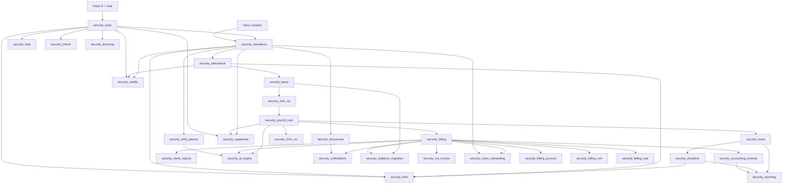

# DogForce Security Suite — Architecture

This document describes the system design of the DogForce Security Suite: how components interact, how data flows through the platform, which third-party systems are involved, and the design patterns that keep the codebase maintainable across clients and countries.

---

## 1. System Context

The suite is a **modular monolith** built on Odoo Community. All business logic, persistence, security, and reporting run inside a single Odoo application backed by PostgreSQL. A separate **Expo mobile client** connects to Odoo over HTTP for field operations.

```text
┌─────────────────────────────────────────────────────────────────┐
│                        Field Users                              │
│   Supervisors · Site Managers · Business Owners                 │
└───────────────┬─────────────────────────────┬───────────────────┘
                │                             │
                ▼                             ▼
┌───────────────────────┐         ┌───────────────────────────────┐
│   DogForce Mobile     │         │   Odoo Web UI                 │
│   (Expo / RN / TS)    │         │   (Browser)                   │
└───────────┬───────────┘         └───────────────┬───────────────┘
            │                                     │
            │  JSON-RPC + REST JSON               │  HTTP / ORM
            ▼                                     ▼
┌─────────────────────────────────────────────────────────────────┐
│                    Odoo 19 Community                            │
│  ┌──────────────────────────────────────────────────────────┐   │
│  │              Custom Security Suite Modules               │   │
│  │  base → operations → attendance → leave → payroll → …  │   │
│  └──────────────────────────────────────────────────────────┘   │
│  ┌──────────────┐  ┌──────────────┐  ┌──────────────────────┐   │
│  │ Odoo Core    │  │ HR / Mail    │  │ QWeb PDF Reports     │   │
│  │ (ORM, ACL)   │  │ Contacts     │  │                      │   │
│  └──────────────┘  └──────────────┘  └──────────────────────┘   │
└───────────────────────────────┬─────────────────────────────────┘
                                │
                                ▼
                    ┌───────────────────────┐
                    │   PostgreSQL 16       │
                    └───────────────────────┘
```

There are no microservices in the current architecture. Scalability and deployment simplicity come from Odoo's process model and PostgreSQL, not from distributed services.

---

## 2. Architectural Style and Design Patterns

### 2.1 Odoo MVC (Model–View–Controller)

Each module follows Odoo's standard layering:

| Layer | Responsibility | Examples in this codebase |
|-------|----------------|---------------------------|
| **Model** | Business entities, computed fields, constraints, workflow actions | `security.roster.slot`, `security.payslip`, `security.attendance.record` |
| **View** | XML forms, lists, kanban, pivot/graph dashboards | `views/security_operations_views.xml`, `security_reporting` pivot views |
| **Controller** | HTTP endpoints outside standard ORM UI | `security_mobile/controllers/main.py` — JSON REST API |

Business rules live in Python models. UI is declarative XML. The mobile app bypasses standard views and uses controllers as a thin API layer.

### 2.2 Modular Monolith with Dependency Layers

Modules are vertically sliced by business capability but deployed as one application. Dependencies form a directed acyclic graph — no circular imports between custom modules.



**Parallel branches** attach at different layers:

- **Documents** (`security_documents`) — guard compliance documents, off the operations layer
- **Equipment** (`security_equipment`) — asset allocation and payroll deductions, off base + payroll + operations
- **Fleet** (`security_fleet`) — transport and shuttles, off base + operations + attendance + discipline
- **Mobile API** (`security_mobile`) — field attendance API, off base + operations + attendance

### 2.3 Model Extension (`_inherit`)

Rather than duplicating entities, modules extend existing models:

| Extended model | Extended by | Purpose |
|----------------|-------------|---------|
| `hr.employee` | `security_base`, `security_payroll_core`, `security_mobile` | Guard profile, pay rates, mobile session fields |
| `security.payslip` | `security_loans`, `security_discipline`, `security_equipment` | Aggregate deductions from loans, incidents, equipment damage |
| `security.roster.slot` | `security_leave` | Block assignment during approved leave |
| `security.billing.invoice` | `security_accounting_controls` | Payment tracking and ageing |
| `security.incident` | `security_fleet` | Link discipline incidents to vehicles |
| `security.vehicle` | `security_fleet` | Fleet-specific computed fields |
| `security.payslip` | `security_ai_engine` | AI narrative fields |
| `hr.employee` | `security_ai_engine` | AI risk profile fields |
| `security.billing.invoice` | `security_ai_engine` | AI audit fields |
| `security.roster.batch` | `security_ai_engine` | AI optimizer fields |
| `security.roster.slot` | `security_shift_planner` | Guard scoring and suggestions |
| `crm.lead` | `security_billing_crm` | Map CRM leads to custom security billing plans |
| `security.billing.plan` | `security_billing_crm`, `security_billing_sale` | Link billing plans to opportunities and sales orders |
| `sale.order` | `security_billing_sale` | Integrate custom security services with sales contracts |
| `security.billing.invoice` | `security_billing_account`, `security_zra_invoice` | Sync custom security invoices with standard `account.move` journal entries and ZRA fiscal signatures |
| `res.config.settings` | `security_licensing`, `security_theme`, `security_demo_site` | System-wide theme selection, license validation controls, and sandbox restrictions |

This is the primary integration mechanism between modules — no shared service layer, no event bus.

### 2.4 Configuration Over Code

Business rules that vary by client or country are stored as records, not hardcoded constants:

- Payroll rule sets, tax brackets, SSC rates → `security_l10n_na`
- Incident types, leave types, billing plans → respective modules
- Grades, certifications, post types → `security_base` / `security_operations`

Developers add structure; administrators configure behavior.

### 2.5 Country-Neutral Core + Localization Pack

| Layer | Scope | Module |
|-------|-------|--------|
| Core operations | Any country | `security_base`, `security_operations`, `security_attendance`, `security_leave` |
| Payroll engine | Country-agnostic computation pipeline | `security_payroll_core` |
| Namibia rules | PAYE, SSC, holidays, premiums | `security_l10n_na` |
| Zambia rules | NAPSA, NHIMA, WCF levy, PAYE brackets, ZRA Smart Invoice | `security_l10n_zm`, `security_zra_invoice` |
| Client-specific | Migration, defaults, imports | `security_dogforce_migration` — CSV import for guards, clients, leave balances, loans |

Both `security_l10n_na` and `security_l10n_zm` depend on the same `security_payroll_core` engine. Country-specific rules are data records, not engine logic — adding a new market means adding a new localization pack, not rewriting roster or attendance.

### 2.6 Workflow Actions and Computed Fields

State transitions are explicit Python methods on models:

- `action_generate_from_roster()` — attendance batch from roster slots
- `action_generate_payslips()` — payslips from attendance in a period
- `action_compute_from_sources()` — aggregate hours, premiums, deductions
- `action_capture()` / `action_approve()` — posting sheet and overtime workflows

Derived values use `@api.depends` computed fields (worked hours, late minutes, payslip totals, invoice VAT). This keeps read paths fast and write paths auditable.

### 2.7 Optional Cross-Module Integration

Some modules use defensive checks when a dependency model may not exist:

```python
if "security.incident" in self.env:
    # pull incident deductions
```

This allows partial installs during development and avoids hard failures when optional modules are not installed.

---

## 3. Component Responsibilities

### 3.1 Identity and Qualification — `security_base`

Foundation layer. Extends `hr.employee` with guard-specific fields and defines master data:

- Grades, certifications, languages, attributes
- Reliability score and manual adjustments
- Disqualification reasons and flags
- Security user groups: Supervisor, Manager, Owner, HR/Payroll Officer, System Auditor

All downstream modules assume guard profiles exist here.

### 3.2 Operational Planning — `security_operations`

Models the client contract hierarchy:

```text
res.partner (client)
  └── security.client.site
        └── security.post
              └── security.shift.requirement
                    └── security.roster.batch → security.roster.slot
```

Roster slots carry the planned guard, shift template, and site. Assignment validation checks grade, certifications, disqualification, rest rules, and leave conflicts. Supervisor overrides require a reason for audit.

### 3.3 Attendance — `security_attendance`

Bridges planning to actuals:

- **Posting sheet** (`security.attendance.batch`) — daily or per-site collection of attendance records
- **Attendance record** (`security.attendance.record`) — links to roster slot; stores check-in/out, manual presence, overtime approval

Metrics computed: scheduled hours, worked hours, valid hours, late minutes, early departure, missing checkout, absence status.

### 3.4 Leave — `security_leave`

Leave types, employee balances, and approval workflow. Approved leave links to payslip computation and can block roster assignment via roster slot extension.

### 3.5 Payroll — `security_l10n_na` + `security_l10n_zm` + `security_payroll_core`

**Core engine** (`security_payroll_core`) runs the payroll pipeline:

1. Open a payroll period
2. Generate payslips for active guards
3. Pull attendance records in the date range
4. Apply hour categorization (normal, Sunday, holiday, night, overtime)
5. Calculate statutory deductions from the active rule set
6. Pull cross-module deductions (loans, incidents, equipment damage, no-work-no-pay)
7. Produce PDF payslip via QWeb report

**Namibia localization** (`security_l10n_na`) provides country-specific configuration: rule sets, PAYE brackets, SSC parameters, public holidays. Payroll calculations are **test-driven** — `security_payroll_core/tests/test_payroll.py` covers statutory and premium scenarios.

**Zambia localization** (`security_l10n_zm`) provides separate country configuration and overrides:

- Statutory deductions: NAPSA (5 % employee + 5 % employer, capped at ZMW 34,164 p.a.), NHIMA (0.5 % + 0.5 %, no cap), WCF levy (employer-only, Class IX WCFCB rate, updatable per assessment)
- PAYE: annual progressive brackets with NAPSA deductible before tax calculation
- ZM payslip PDF: XPath overrides replace SSC lines with NAPSA/NHIMA/WCF lines and localize currency
- Tests: `security_l10n_zm/tests/test_zm_payroll.py` — 7 scenarios (NAPSA cap, no-cap, NHIMA, PAYE deductibility, floor cap, combined)

### 3.6 Deductions and Discipline — `security_loans`, `security_discipline`

- **Loans:** employee loan schedules with automatic payslip deduction lines
- **Discipline:** incident types with reliability score impact and optional payroll deductions

Both extend `security.payslip` to inject deduction lines during `action_compute_from_sources()`.

### 3.7 Billing and Receivables — `security_billing`, `security_accounting_controls`, `security_client_reports`

Billing uses a **custom invoice model** (`security.billing.invoice`), not Odoo Accounting's `account.move`. This keeps the suite Community-compatible without requiring the Accounting app.

- Billing plans define contract rates and generation rules
- Invoices compute VAT, amount-in-words, and branding for Namibian format
- Accounting controls track client payments and ageing
- Client reports aggregate attendance into service summaries for client delivery

### 3.8 Fiscal Compliance — `security_zra_invoice`

Wraps Zambia's ZRA Smart Invoice (VSDC API) for fiscally-compliant invoicing:

- Extends `security.billing.invoice` with TPIN and VSDC fields; warning banner on form if TPIN is not configured
- `_submit_to_zra()` — builds ZRA JSON payload and posts to VSDC API; stores raw request/response
- `_submit_zra_cancellation()` and `action_cancel()` override — sends cancellation to VSDC before voiding the local invoice
- `security.zra.submission` log model — tracks state (`pending` / `accepted` / `rejected` / `error`), receipt number, signature, and audit trail
- Exponential backoff cron (`action_retry_pending`) — retry schedule: 2 → 10 → 30 → 120 → 240 minutes; stops after 5 retries
- Bulk submission wizard (`security.zra.bulk.submit`) — select and submit multiple invoices in one action from the Billing menu

### 3.9 In-App Help Centre — `security_help`

OWL-based searchable help portal surfaced as an Odoo client action:

- `security.help.category` and `security.help.article` models with `country_code` field; blank = visible everywhere
- `get_company_country_code()` API returns `company.country_id.code` for client-side filtering
- `search_articles(query, country_code)` — full-text search across title, summary, and tags with country domain intersection
- OWL component `HelpPortal` — category browser, article reader, 300 ms debounced search, Escape to clear
- Seeded content: Namibia onboarding articles (categories: Payroll, Operations, System Setup) + Zambia payroll and ZRA Smart Invoice articles (only shown to ZM-country tenants)

### 3.10 Supporting Domains

| Module | Role |
|--------|------|
| `security_documents` | Guard document types, expiry tracking, verification status |
| `security_equipment` | Equipment categories, allocations to guards, damage claims → payroll deduction |
| `security_fleet` | Vehicles, shuttle routes/runs/passengers, fuel logs, inspections, service logs |
| `security_reporting` | Pivot/graph views only — no new models; dashboards on existing data |
| `security_client_onboarding` | 6-step wizard to onboard a new client, link contracts, sites, shift requirements, and generate first roster batch |
| `security_theme` | DogForce white-label branding, login customization, preset color themes, and corporate PDF reports |
| `security_licensing` | License enforcement, certificate management, and system entitlement limits for DeployGuard OS |
| `security_billing_account` | Auto-installed integration between custom security invoices and standard Odoo customer invoices (`account.move`) |
| `security_billing_crm` | Auto-installed integration between custom security billing plans and CRM leads/opportunities |
| `security_billing_sale` | Auto-installed integration between custom security billing plans and standard Sales Orders |
| `security_demo_data` | Post-install hook seeds a full Namibian demo company |
| `security_demo_data_zm` | Post-init hook to seed complete Zambian operational and payroll demo data for Sentinel Security Ltd |
| `security_demo_site` | Demo site login panel and demo account management for sandbox environments |
| `security_shift_planner` | Constraint-satisfaction guard scoring, roster suggestions, Roster Board OWL |
| `security_ai_engine` | Multi-provider AI facade (Claude/OpenAI/Gemini); anomaly detection, risk profiling, billing audit, roster optimizer |
| `security_notifications` | Internal alert model; daily crons scan document expiry and overdue invoices |
| `security_dogforce_migration` | CSV import tools for guards, clients, leave balances, and loans with row-level error logging |
| `security_suite` | Meta-module that installs the complete Security Suite (all 34 modules) in one step |

---

## 4. Data Flow

### 4.1 End-to-End Operational Pipeline

```text
┌─────────────┐    ┌──────────────┐    ┌─────────────────┐    ┌──────────────┐
│ Client      │───▶│ Site / Post  │───▶│ Roster Slot     │───▶│ Attendance   │
│ (partner)   │    │ + Shift Req  │    │ (planned guard) │    │ Record       │
└─────────────┘    └──────────────┘    └─────────────────┘    └──────┬───────┘
                                                                       │
                    ┌──────────────────────────────────────────────────┤
                    │                                                  │
                    ▼                                                  ▼
           ┌────────────────┐                              ┌───────────────────┐
           │ Payroll Period │                              │ Billing Invoice   │
           │ → Payslip      │                              │ + Client Report   │
           └────────┬───────┘                              └───────────────────┘
                    │
     ┌──────────────┼──────────────┬─────────────────┐
     ▼              ▼              ▼                 ▼
┌─────────┐   ┌───────────┐  ┌──────────┐    ┌─────────────┐
│ Loans   │   │ Incidents │  │ Equipment│    │ Leave       │
│ deduct  │   │ deduct    │  │ damage   │    │ no-work-no- │
└─────────┘   └───────────┘  └──────────┘    │ pay         │
                                               └─────────────┘
```

### 4.2 Attendance Capture Paths

Attendance records can be populated through:

1. **Odoo web UI** — HR/supervisor posting sheet workflow
2. **Mobile app** — `security_mobile` REST endpoints for mark presence, check-in/out, batch submit
3. **Roster generation** — `action_generate_from_roster()` pre-creates records from planned slots

Managers approve overtime via web UI or the manager mobile dashboard.

### 4.3 Payroll Computation Flow

```text
security.payroll.period (date range, state)
        │
        ▼ action_generate_payslips()
security.payslip (per employee)
        │
        ▼ action_compute_from_sources()
        ├── Query security.attendance.record in period
        ├── Categorize hours (normal / Sunday / holiday / night / OT)
        ├── Apply security.payroll.rule.set multipliers (from security_l10n_na)
        ├── Calculate SSC and PAYE (brackets from security_l10n_na)
        ├── Pull security.employee.loan active deductions
        ├── Pull approved security.incident payroll deductions
        ├── Pull approved security.equipment.damage deductions
        └── Apply approved leave / no-work-no-pay adjustments
        │
        ▼
PDF payslip (QWeb report: security_payslip_report.xml)
```

### 4.4 Billing Flow

```text
security.billing.plan (contract terms)
        │
        ▼ generate from roster slots and/or attendance records
security.billing.invoice
        ├── Line items from hours/posts/rates
        ├── VAT computation
        └── Amount in words (Namibian format)
        │
        ├──▶ security.client.payment (reconciliation)
        └──▶ security.client.service.report (client-facing PDF)
```

---

## 5. Mobile App Architecture

The mobile app is a **thin client**. It does not embed business rules — all validation and computation happen in Odoo.

### 5.1 Authentication

```text
Mobile App                    Odoo
    │                           │
    │ POST /web/session/        │
    │      authenticate         │
    │ ─────────────────────────▶│
    │◀── session_id cookie ─────│
    │                           │
    │ Store session in          │
    │ Expo SecureStore          │
```

Subsequent requests send `X-Openerp-Session-Id` and cookie headers.

### 5.2 Business API

Custom endpoints in `security_mobile` (all require authenticated user + role group):

| Role | Group | Key endpoints |
|------|-------|---------------|
| Supervisor | `group_security_supervisor` | Today's posting sheet, mark presence, check-in/out, submit batch |
| Manager | `group_security_manager` | Multi-site dashboard, site detail, overtime approve/reject |
| Owner | `group_security_owner` | Executive KPIs (attendance, payroll YTD, invoices) |

Response envelope:

```json
{ "success": true, "data": { ... } }
{ "success": false, "error": "message" }
```

Access control uses a `@require_group()` decorator checking Odoo security groups defined in `security_base`.

### 5.3 Mobile App Structure

```text
mobile/
├── app/                    # Expo Router file-based routes
│   ├── (auth)/login.tsx
│   ├── (supervisor)/       # Posting sheet, history
│   ├── (manager)/          # Dashboard, overtime
│   └── (owner)/            # KPIs
└── src/
    ├── api/                # Axios client + endpoint modules
    ├── stores/             # Zustand auth and app state
    ├── components/         # Reusable UI (GuardCard, KpiMetric, …)
    └── theme/              # Dark theme tokens
```

Role routing happens client-side after login (heuristic on username/name); Odoo enforces authorization on every API call.

---

## 6. Security Model

### 6.1 Odoo Access Control

Each module ships `security/ir.model.access.csv` defining CRUD permissions per model per group. Record-level rules can be added via `ir.rule` XML (used sparingly today).

### 6.2 Role Hierarchy

Defined in `security_base/security/security_groups.xml`:

```text
Supervisor ──▶ Manager ──▶ Owner
                  │
HR/Payroll Officer (parallel)
System Auditor (read-only oversight)
```

Mobile roles inherit this chain. Field supervisors see only their assigned sites; managers see multi-site summaries; owners see aggregate KPIs.

### 6.3 Auditability

Workflow actions record state changes on models (batch review states, override reasons, payment reconciliation status). The architecture treats audit trails as a product feature, not an afterthought — roster overrides, attendance corrections, and payroll deductions should all be traceable to a user and reason.

---

## 7. Third-Party Integrations

| Integration | Role | Status |
|-------------|------|--------|
| **Odoo 19 Community** | ERP platform, ORM, web UI, JSON-RPC | Active development target |
| **PostgreSQL 16** | Primary data store | Via Docker Compose |
| **Docker / Docker Compose** | Local dev and deployment packaging | Implemented |
| **Expo / React Native** | Mobile field app | Scaffolded, connected to API |
| **ZRA VSDC API** | Zambia ZRA Smart Invoice fiscal signing | Implemented (`security_zra_invoice`); endpoint configurable via `ir.config_parameter` |
| **Odoo Enterprise** | DogForce production environment | Not a repo dependency; integration points deferred |
| **Odoo Accounting (`account`)** | General ledger, bank reconciliation | Not a module dependency; owner KPI optionally reads `account.move` if installed |
| **OCA modules** | Community payroll/accounting supplements | Referenced in planning docs; none vendored |
| **FCM / push notifications** | Mobile alerts | Field exists (`security_mobile_device_token`); not wired |
| **GPS / biometric devices** | Automated clock-in | Explicitly deferred (Phase 2+) |
| **Bank statement import** | Accounting reconciliation | Planned in backlog; not implemented |

---

## 8. Deployment Architecture

### 8.1 Local Development

```text
docker-compose.yml
├── db (postgres:16)
│     └── volume: .local/postgres
└── odoo (odoo:19.0)
      ├── port 8069 (HTTP)
      ├── port 8072 (longpolling)
      ├── volume: custom_addons → /mnt/extra-addons
      └── volume: .local/odoo (filestore)
```

`scripts/start.sh` generates `.local/odoo.conf` from `.env` on each start.

### 8.2 Staging and production

Staging and production deployment procedures, CI/CD, and rollback are documented in [DEPLOYMENT.md](DEPLOYMENT.md).

Summary:

- **CI:** GitHub Actions runs Odoo tests and mobile type checks on every PR (`.github/workflows/ci.yml`)
- **CD:** Manual promote to staging, then production after UAT
- **Rollback:** Code checkout, database restore, or Docker image pin depending on failure type

---

## 9. Testing Strategy

| Area | Approach | Coverage today |
|------|----------|----------------|
| Payroll statutory logic | Odoo `TransactionCase` | `security_payroll_core/tests/test_payroll.py` |
| Payroll pipeline integration | Odoo `TransactionCase` | `security_payroll_core/tests/test_payroll_pipeline.py` |
| Payroll anomaly detection | Odoo `TransactionCase` | `security_payroll_core/tests/test_anomaly_detection.py` |
| Attendance scenarios | Odoo `TransactionCase` | `security_attendance/tests/test_attendance_scenarios.py` |
| Equipment deductions | Model integration | `security_equipment/tests/test_equipment.py` |
| Fleet operations | Model integration | `security_fleet/tests/test_fleet.py` |
| Zambia statutory payroll | Odoo `TransactionCase` | `security_l10n_zm/tests/test_zm_payroll.py` — 7 scenarios (NAPSA cap/no-cap, NHIMA, PAYE deductibility, WCF floor, combined) |
| Mobile API | Manual | No automated controller tests |
| CI | Not configured | Run via `odoo --test-enable` |

---

## 10. Implementation Status and Known Gaps

### Built

The full module chain from base through billing, plus equipment, fleet, mobile API, client reports, and demo data, exists in `custom_addons/`. Maturity varies — core operational and payroll paths are the most complete.

**Recently completed:**
- Zambia localization (`security_l10n_zm`) — NAPSA, NHIMA, WCF, PAYE, ZM payslip PDF, 7 unit tests
- ZRA Smart Invoice (`security_zra_invoice`) — VSDC API integration, cancellation, bulk wizard, exponential backoff cron
- In-app Help Centre (`security_help`) — OWL portal, country-aware articles, Zambia content seeded
- Client Onboarding Wizard (`security_client_onboarding`) — 6-step unified client onboarding wizard (contract, sites, posts, requirements, billing, first roster batch)
- White-label Theme (`security_theme`) — system branding, color theme preset switcher, custom login panel
- DeployGuard Licensing (`security_licensing`) — license key validation, admin settings, run-time capability enforcement
- Standard Odoo Integrations — CRM, Sales, and Accounting integration bridges for custom billing plans (`security_billing_crm`, `security_billing_sale`, `security_billing_account`)
- `security_suite` meta-module for one-step install (all 34 modules)
- `security_demo_site` demo environment panel

### Planned but not implemented

| Item | Notes |
|------|-------|
| Bank reconciliation / statement import | Requires Accounting integration or custom module |
| 2FA for accounting roles | Backlog item |
| GPS / device clock-in | Deferred to Phase 2 |
| CI / automated test runner | No GitHub Actions config yet |
| Production deployment manual | Referenced in DEPLOYMENT.md |
| Client portal (`security_portal`) | Planned Sprint E item, not yet built |
| FCM push notifications | Device token field exists; endpoint not wired |

### Architectural debt to resolve

- **Billing vs Accounting:** Custom `security.billing.invoice` avoids Enterprise/Accounting dependency but will need a bridge to `account.move` for full GL integration.
- **Mobile API field alignment:** Some controller queries may reference field names that differ from model definitions — verify before production mobile rollout.
- **Billing vs GL:** Custom `security.billing.invoice` is Community-compatible but will need a bridge to `account.move` for full general-ledger integration if the Accounting app is ever enabled.

---

## 11. Extension Points

When extending the suite, prefer these patterns:

1. **New country** — Add `security_l10n_XX` depending on `security_payroll_core`; load tax/bracket/holiday data via XML/CSV
2. **New deduction type** — Create model + `_inherit` on `security.payslip` + hook in `action_compute_from_sources()`
3. **New mobile screen** — Add controller endpoint in `security_mobile` + API module in `mobile/src/api/` + Expo route
4. **New report** — QWeb template in `reports/` + server action or print button on source model
5. **Client-specific defaults** — Separate migration/config module, not changes to core modules

---

## Related Documentation

- [README.md](README.md) — Quick start, module list, daily commands
- [docs/adr/README.md](docs/adr/README.md) — Architecture Decision Records
- [docs/security_mobile.md](docs/security_mobile.md) — Mobile API specification
