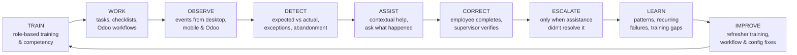

# 01 — Product Vision

> Status: Draft for approval · Owner: Product

## 1. The problem

Security companies buy and deploy ERP systems, but their people do not consistently use them. The failure is rarely the software's feature list. It is the gap between *installed* and *operated*:

- An employee hits a small obstacle: a permission error, an unfamiliar screen, a workflow nobody explained.
- Nobody notices, so they quietly go back to WhatsApp, paper or a spreadsheet.
- Managers are too busy to chase every missed step, and cannot see what is **not** happening.
- The owner sees reports built on incomplete data and loses confidence in the system.
- The implementation partner becomes a human reminder service, which does not scale.

DogForce Security Services shows this clearly: a mature Odoo 19 platform with 37 installed security modules, **210 employees and 4 internal users** ([00-current-state](00-current-state.md) §1).

## 2. Vision statement

> **DeployGuard OS makes a security company actually operate through its systems — and when it doesn't, shows exactly what should happen next.**

DeployGuard OS is the **human operations, training, adoption, accountability and intelligence layer above the ERP**. Odoo remains the system of record for operational and financial data. DeployGuard makes sure people are able to do their work in it, are doing it, and get help quickly when they are not.

The question it answers for every company:

> *"Is this security company operating effectively through its systems, and if not, what should happen next?"*

## 3. The operating loop

Every capability in DeployGuard OS exists to drive one continuous loop:

| Stage | What the system does | Who acts |
|---|---|---|
| Train | Assigns role-appropriate courses; verifies competency through assessment and supervised real work. | Employee, supervisor |
| Work | Presents "what I need to do now": tasks, checklists and deep links into the right Odoo screen. | Employee |
| Observe | Records meaningful operational events (not just logins) from the desktop, mobile and Odoo. | System |
| Detect | Compares expected work with what actually happened; raises exceptions and silent-abandonment signals. | System (deterministic) |
| Assist | Helps first: contextual help, knowledge articles, "what happened?" prompts, support requests. | System, then support |
| Correct | The employee completes the work; the supervisor verifies it and records competency evidence. | Employee, supervisor |
| Escalate | Graduated escalation to supervisor, then manager, with evidence, only when assistance did not work. | Supervisor, manager |
| Learn | Aggregates patterns: recurring failure points, training gaps, adoption trends. | System (rules + AI interpretation) |
| Improve | Recommends refresher training, workflow and configuration changes, staffing attention; humans approve. | Manager, owner, admin |

## 4. What DeployGuard OS is — and is not

| It **is** | It is **not** |
|---|---|
| An operational intelligence system for security companies | Another ERP or an Odoo replacement |
| Security-specific work management (site checks, handovers, reviews) built on generic task primitives | A generic project-management tool (Asana/ClickUp clone) |
| Role-based training tied to real work and verified competency | A generic LMS that tracks video views |
| An adoption engine that measures meaningful operational behaviour against expectations | A login-count dashboard or employee surveillance tool |
| An exception-first management experience ("what needs my attention") | A wall of dashboards |
| AI that detects, explains, drafts and prioritises, with evidence and human approval | A chatbot bolted onto Odoo, or an autonomous decision-maker |

## 5. Product family and naming

Proposed in [DG-ADR-019](adr/DG-ADR-019-product-naming.md), pending confirmation (OQ-2):

| Name | What it refers to |
|---|---|
| **DeployGuard OS** | The product family a security company buys. |
| **DeployGuard ERP** | The Odoo 19 `security_*` addon suite: rostering, attendance, payroll, billing, equipment, fleet. System of record. |
| **DeployGuard Platform** | The new layer: backend services, Windows desktop app, web app. Training, work, adoption, exceptions, intelligence. |
| **DeployGuard Mobile** | The Expo app for guards and field roles. |
| **Bridge addons** | Odoo addons (`security_deployguard_*`) that connect DeployGuard ERP to the Platform. |

## 6. Who it serves

| Role | Core question the product answers | Primary channel (MVP) |
|---|---|---|
| Security Guard / Senior Guard | "What do I need to do on this shift?" | Mobile / WhatsApp (via ERP); Platform features in V2 |
| Site Supervisor | "Are my sites and guards covered, and what must I verify?" | Desktop |
| Operations Officer | "Which operational tasks and records are outstanding?" | Desktop |
| Operations Manager | "What should I deal with first?" | Desktop + web |
| HR / Admin | "Who is untrained, uncertified, or blocked?" | Desktop |
| Owner / Executive | "Is the business operating effectively, and where is the risk?" | Web + weekly brief |
| Platform Administrator | "Is each tenant configured, connected and healthy?" | Web |

Details in [03-personas-and-roles](03-personas-and-roles.md).

## 7. Product principles

1. **Help before blame.** Every detection path starts with assistance. Adoption signals are never automatically disciplinary.
2. **Expected work, not activity.** Measure what *should* have happened against what did. Logins prove nothing.
3. **Exceptions over dashboards.** Management sees what needs action, ranked, with evidence.
4. **Deterministic facts, AI interpretation.** Rules decide whether something is overdue; AI explains patterns and drafts recommendations with citations.
5. **Humans approve consequences.** Nothing that affects employment, policy, HR records or financial data happens without an authorised human.
6. **One source of truth per fact.** Odoo owns ERP facts; the Platform owns training, work, adoption and intelligence ([14-data-model](14-data-model.md) §Data ownership).
7. **Simple for the employee, dense for management.** The employee screen answers one question; management screens can carry more information.
8. **One product feel.** The desktop and web shell mirror `security_shell` and follow the DeployGuard design system.
9. **Productizable from day one.** Tenant-scoped everything; DogForce-specific behaviour lives in configuration, not core code ([30-productization](30-productization.md)).
10. **Operationally boring infrastructure.** Modular monolith, PostgreSQL, explicit events; no speculative microservices.

## 8. Outcomes and success measures

Targets are proposals to be agreed with the DogForce operations manager at the start of rollout ([31-dogforce-rollout](31-dogforce-rollout.md)). The baseline is measured from Odoo data **before** the desktop rollout.

| Outcome | Measure | Proposed 90-day target (pilot group) |
|---|---|---|
| Work happens in the system | **Workflow Coverage**: expected key workflows completed in-system ÷ expected | ≥ 80 % |
| Work happens on time | Attendance batches posted by cut-off; incident reviews within SLA | ≥ 85 % on time |
| People are trained | Pilot users who completed and were verified on the "Using DeployGuard ERP" track | 100 % |
| Problems surface quickly | Median time from silent-abandonment signal to resolution | < 2 working days |
| Management acts on exceptions | Critical exceptions resolved within policy SLA | ≥ 90 % |
| The platform is used | Weekly active provisioned desktop users performing ≥ 1 meaningful action | ≥ 90 % |
| Less human chasing | Manual follow-ups logged by the implementation partner | Downward trend month over month |

**North-star metric:** *Workflow Coverage*, the share of expected operational work that is actually executed through the company's systems.

## 9. Non-goals (for the foreseeable roadmap)

- Replacing any DeployGuard ERP (Odoo) capability: rostering, payroll, billing, accounting, equipment, fleet.
- Generic project boards, Gantt charts, or unrestricted custom workflow builders.
- Employee monitoring beyond work-related events in company systems (no screen capture, keystroke logging or location tracking from the desktop).
- Autonomous AI actions with employment, policy, HR or financial consequences.
- Kubernetes, Kafka, or microservices before measured need.
