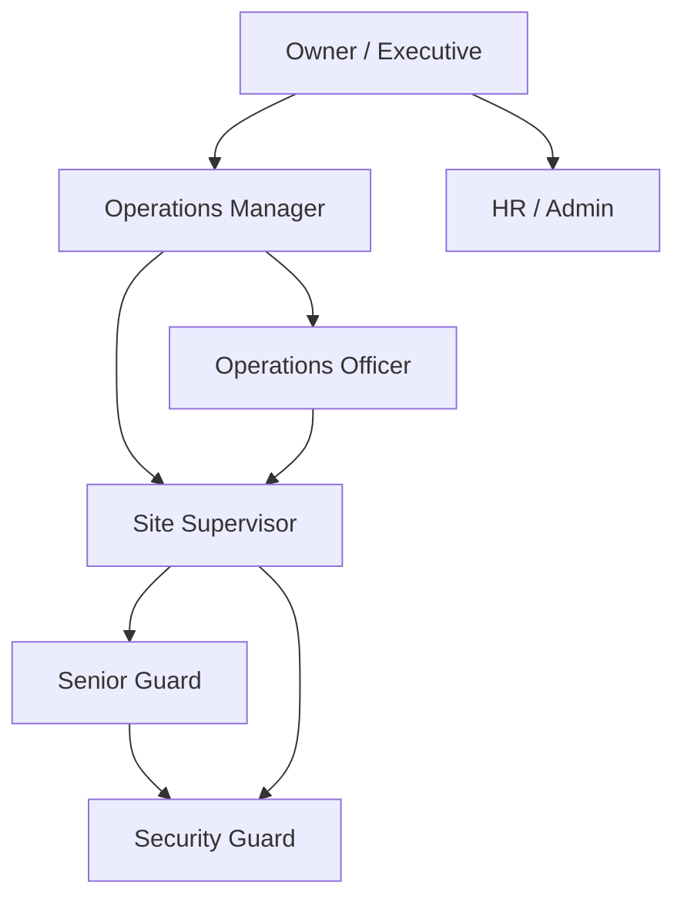

# 03 — Personas & Roles

> Status: Draft · Owner: Product
>
> Personas are archetypes, not real individuals. Roles are the Platform's default role catalogue; tenants may rename them or add custom roles built from the same permission set ([16](16-security-architecture.md) §4).

---

## 1. Role catalogue

| Role key | Display name | Scope | MVP channel | Maps to Odoo group (DeployGuard ERP) |
|---|---|---|---|---|
| `guard` | Security Guard | Self | Mobile / WhatsApp (ERP) — Platform in V2 | `security_base.group_security_guard` |
| `senior_guard` | Senior Guard | Self + assigned post | Mobile (V2) | `group_security_guard` |
| `site_supervisor` | Site Supervisor | Assigned sites + their guards | **Desktop** | `group_security_supervisor` |
| `ops_officer` | Operations Officer | Assigned region/sites | **Desktop** | `group_security_supervisor` |
| `ops_manager` | Operations Manager | Tenant (operations) | **Desktop + web** | `group_security_manager` |
| `hr_admin` | HR / Admin | Tenant (people, training) | **Desktop** | `group_security_hr_payroll_officer` |
| `owner` | Owner / Executive | Tenant (all, read-mostly) | **Web + digest** (desktop optional) | `group_security_owner` |
| `tenant_admin` | Tenant Administrator | Tenant configuration | Web | `base.group_system` (for integration setup only) |
| `platform_admin` | Platform Administrator | Platform (cross-tenant ops, no tenant content by default) | Web (internal) | — |
| `support_agent` | Support Agent | Support requests of tenants they serve; time-boxed impersonation-free access | Web (internal / partner) | — |

**Notes**

- A user can hold several roles; permissions are the union, but *scopes* are evaluated per role assignment (e.g. `site_supervisor@Site A` + `ops_officer@North region`).
- Odoo group mapping is used to **suggest** roles during provisioning and to detect drift. It is never used as the Platform's source of authorisation.
- `tenant_admin` and `platform_admin` are separate. The DogForce implementation partner holds `tenant_admin` for DogForce but not `platform_admin` rights over other tenants.

## 2. Reporting hierarchy

- The hierarchy is stored as explicit `reporting_line` relationships (manager → report), with optional site scoping. It is **not** inferred from roles.
- The Odoo `hr.employee.parent_id` is imported as a suggestion; the Platform line is authoritative for escalation routing ([14](14-data-model.md)).
- Escalation follows the reporting line upward, skipping vacant or on-leave positions (leave comes from Odoo).

---

## 3. Personas

### 3.1 Site Supervisor — "Keep my sites covered and my guards right"

| | |
|---|---|
| **Context** | Responsible for 3–8 sites and 20–60 guards. Moves between sites by vehicle; spends part of the day at an office PC. Lives on WhatsApp. |
| **Goals** | Every post covered; attendance captured correctly; incidents recorded and reported to clients; guards equipped and compliant. |
| **Pains** | Chasing guards by phone; attendance corrections after payroll cut-off; forgetting site visits; not knowing how to do something in Odoo, so doing it on paper. |
| **Jobs to be done** | Post attendance batch before cut-off · verify site visit checklist · review guard-submitted incidents · hand over to night supervisor · confirm guard competency on practical tasks. |
| **Success in DeployGuard** | Opens the app, sees today's 6 items, completes them, and the Odoo records exist. Gets help in-context instead of calling the ops manager. |
| **MVP screens** | Home · My Work · Checklist runner · Team (my guards: training/competency status) · Verify queue · Training · Help. |
| **Risks** | Low digital confidence; shared or old PCs; perceives tracking as surveillance → messaging matters ([31](31-dogforce-rollout.md)). |

### 3.2 Operations Officer — "Make sure the paperwork of operations actually happens"

| | |
|---|---|
| **Context** | Office-based; handles rosters, client requests, incident follow-up, reports. Heavier Odoo user. |
| **Goals** | Records complete and on time; client reports sent; roster gaps filled. |
| **Pains** | Discovering missed work late; unclear ownership between supervisors; repeated questions from colleagues. |
| **Jobs** | Review occurrence reports · process client requests · follow up overdue supervisor work · prepare client service reports. |
| **MVP screens** | Home · My Work · Exceptions (scoped) · Sites · Training · Help. |

### 3.3 Operations Manager — "What should I deal with first?"

| | |
|---|---|
| **Context** | Accountable for operational performance and, explicitly, for system adoption. Time-poor; switches context constantly. |
| **Goals** | Nothing critical missed; supervisors doing their jobs in the system; problems fixed before the owner hears about them. |
| **Pains** | Dozens of dashboards; learns about failures from clients; has to personally enforce system use. |
| **Jobs** | Triage inbox · approve escalations · review adoption by supervisor/site · assign mandatory training · agree workflow changes. |
| **MVP screens** | Inbox · Today (operations overview) · Adoption · People & Training · Sites · Reports · Help. |
| **Success** | Starts the day in the Inbox, clears Critical in 15 minutes, and trusts that anything not in the inbox is handled. |

### 3.4 HR / Admin — "Who is untrained, uncertified or blocked?"

| | |
|---|---|
| **Context** | Maintains employee records in Odoo, onboarding, documents, certifications; coordinates training. |
| **Jobs** | Provision users from Odoo employees · assign onboarding program · track expiring certifications (from Odoo) · manage training catalogue · handle "my information is wrong" feedback. |
| **MVP screens** | Home · People · Training admin · Competency matrix (V1) · Support queue (people category) · Help. |

### 3.5 Owner / Executive — "Is the business operating effectively?"

| | |
|---|---|
| **Context** | Does not work in individual tasks. Reads summaries on phone or laptop; asks pointed questions. |
| **Goals** | Operational health, client risk, compliance, staff capability, return on the systems investment. |
| **Jobs** | Read weekly brief · drill from a risk to its evidence · ask "why did this change?" · approve major policy changes. |
| **MVP screens** | Executive overview (web) · Weekly digest (email + web) · Adoption & training summary · Exceptions (critical only). |
| **V1** | AI operational brief with citations. |

### 3.6 Security Guard / Senior Guard — "What do I need to do on this shift?" (V2 on Platform)

| | |
|---|---|
| **Context** | Field-based, 12-hour shifts, smartphone of varying quality, intermittent data, sometimes no smartphone. |
| **MVP relationship** | Not a Platform user. Their operational events (attendance, patrols/incidents via DeployGuard Mobile or WhatsApp) arrive through the Odoo bridge and feed site/supervisor adoption and exceptions. Their training records can be captured by supervisors (practical sign-off) in MVP. |
| **V2** | Micro-lessons, shift checklists and acknowledgements in DeployGuard Mobile; WhatsApp nudges. |

### 3.7 Tenant Administrator / Implementation Partner — "Keep this tenant configured and healthy"

| | |
|---|---|
| **Context** | For DogForce this is the implementation partner. Configures roles, sites, templates, Odoo connection, notification policies. |
| **Jobs** | Connect Odoo · map identities · publish templates and courses · tune exception rules · review integration health · handle escalated support. |
| **Design constraint** | Everything this role does must be doable by a future customer's own admin — no "only the developer can do this" steps ([30](30-productization.md)). |

### 3.8 Platform Administrator — "Run the platform"

Internal operators: tenant lifecycle, platform health, AI cost, releases. **No default access to tenant content**; break-glass access is time-boxed, justified and audited ([23](23-audit-system.md)).

---

## 4. Role × capability summary (MVP)

Legend: **E** = execute/own · **V** = view · **A** = approve/verify · **C** = configure · — = none.

| Capability | Supervisor | Ops Officer | Ops Manager | HR/Admin | Owner | Tenant Admin |
|---|---|---|---|---|---|---|
| My work / checklists | E | E | E | E | — | — |
| Verify team work | A (own sites) | A (scope) | A | — | — | — |
| Assign tasks | E (own sites) | E (scope) | E | E (people tasks) | — | C (templates) |
| Training — take | E | E | E | E | optional | — |
| Training — assign | E (own team) | — | E | E | — | — |
| Training — author/publish | — | — | A | E | — | C |
| Competency sign-off | A (practical) | — | A | A (records) | — | — |
| Adoption — own | V | V | V | V | V | — |
| Adoption — team/site | V (own sites) | V (scope) | V | V (training factors) | V (summary) | — |
| Exceptions / inbox | E (own sites) | E (scope) | E | E (people) | V (critical) | C (rules) |
| Support queue | — | — | V | E (people category) | — | E |
| Odoo connection & mapping | — | — | — | V | — | C |
| Audit log | — | — | V (ops) | V (people) | V | V |

## 5. Channel strategy by role

| Role | MVP | V1 | V2 |
|---|---|---|---|
| Supervisor / Ops Officer / HR | Windows desktop (personal machine — no shared computers, R-9) | — | + mobile companion for supervisors |
| Ops Manager | Desktop + web | + AI inbox prioritisation | — |
| Owner | Web + email digest | + AI brief | + WhatsApp brief |
| Guards | ERP mobile/WhatsApp (events only) | — | Platform features in DeployGuard Mobile |
| Admins | Web | — | — |

## 6. Identity source

Every tenant user of the Platform is a **DeployGuard ERP (Odoo) internal user** ([DG-ADR-007](adr/DG-ADR-007-authentication.md)):

- **One login.** Users sign in once with their Odoo login, password and TOTP. The same identity opens Odoo screens from the app without another sign-in.
- **Provisioning consequence.** Before the pilot, every supervisor, ops officer, HR/admin, manager and owner needs an Odoo internal user with the right Odoo group. Only 4 exist today (OQ-8).
- **Roles.** Odoo groups decide what a person can do *inside Odoo*. Platform roles and scopes decide what they can do *in the Platform*. The Platform suggests roles from Odoo groups and flags drift, but never derives authorisation from them automatically.
- **Internal staff.** Only internal platform staff (`platform_admin`, `support_agent`) have Platform-native accounts.
