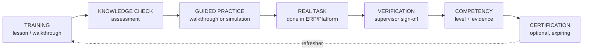

# 07 — Training & Learning Platform

> Status: Draft · Owner: Product · Data model: [14](14-data-model.md) §6 · Approver for DogForce content: **Winston, implementation partner lead (R-8)**
>
> Goal: not "did they watch the video", but **can they do the job in the system**. Training is tied to real work and verified competency.

---

## 1. Learning model



A course is not "complete" for competency purposes until stage D/E has happened. Consumption (lessons watched) and capability (verified work) are tracked separately and never conflated.

## 2. Content structure

| Level | Purpose | Notes |
|---|---|---|
| **Program** | A role's full path, e.g. "New Site Supervisor" | Ordered items, mandatory flags, due offsets from assignment or hire date |
| **Course** | One coherent capability, e.g. "Posting attendance correctly" | Versioned; published versions immutable |
| **Section** | Grouping within a course | (`CourseSection` — named to avoid confusion with software modules) |
| **Lesson** | A single learning unit: rich text, video, document, or interactive walkthrough (V1) | Target 3–7 minutes; offline-downloadable |
| **Assessment** | Knowledge check tied to the course version | Question bank, pass mark, attempt limit |
| **Practical assignment** | A real task/checklist the learner must perform and a supervisor verifies | Produces competency evidence |

**Content principles**

- Short, task-shaped titles ("Post attendance for a night shift"), not topic titles ("Attendance module overview").
- Every lesson ends with "what you will do next", linking to the real screen.
- Screenshots come from the tenant's own ERP configuration wherever possible.
- Plain language at roughly 8th-grade level; English at MVP (A-8).

## 3. Authoring workflow

```
draft → in_review → published (version N) → retired
```

| Step | Who | Rules |
|---|---|---|
| Create/edit draft | HR/Admin, Tenant Admin | Drafts invisible to learners |
| Submit for review | Author | Diff against the previous version shown |
| Approve & publish | **Approver (Winston for DogForce)** | Recorded in audit with approver identity |
| Assign | HR, Ops Manager, Supervisor (own team) | Assignment pins the version |
| Retire | Approver | Existing assignments finish on their pinned version; new assignments use the current one |

AI-drafted content (V2) enters at `draft` and **cannot skip review** ([11](11-ai-intelligence.md) §7). Operational policy and SOP content is always human-authored or human-approved; the Platform never treats generated text as authoritative procedure.

## 4. Assessments

| Type | Use |
|---|---|
| Multiple choice / multi-select | Facts, rules, thresholds |
| True/false | Quick checks (used sparingly) |
| **Scenario** | "It's 05:50, two guards haven't arrived at Site 12 and the batch is due at 06:00. What do you do first?" — the main type for supervisors |
| Ordering | Procedure steps (handover, site opening) |
| Practical (offline-verified) | The real thing, signed off by a supervisor |

Design rules:

- Every question carries `skill_tags` and, per wrong option, `mistake_tags` — the input for adaptive remediation (§8).
- Feedback after each attempt explains *why* an answer was wrong, linked to the lesson or knowledge article.
- Pass mark default 80 %; unlimited attempts by default, with a 24-hour cool-down after two consecutive failures (configurable).
- Question banks randomise selection to discourage answer sharing.

## 5. Competency framework

| Level | Meaning | Typical evidence |
|---|---|---|
| 0 — Not assessed | No evidence | — |
| 1 — Aware | Knows the concept | Lesson completion |
| 2 — Assessed | Can answer correctly | Passed assessment |
| 3 — Performed | Did it for real, verified once | Verified checklist/task + ERP record |
| 4 — Reliable | Performs consistently unaided | ≥ N verified instances over a period, no critical rework |

- **Requirements per role** (`RoleCompetencyRequirement`): e.g. Site Supervisor must reach level 3 in `attendance.posting` within 14 days of assignment, level 3 in `incident.reporting` within 30 days.
- **Evidence** links to its source (attempt, verification, ERP record) so any claim is inspectable.
- **Validity**: competencies may expire (`validity_months`), triggering refresher assignment. Legal certifications stay in DeployGuard ERP; the Platform reads them as context and may push an approved Platform certification into ERP (C-7, V1).
- **Skill matrix** (V1): role × competency grid per site/team with gaps highlighted, and one-click assignment of the missing training.

## 6. Assignment and compliance

| Trigger | Result |
|---|---|
| Role assigned / user provisioned | Program auto-assigned with due offsets |
| Competency expiring | Refresher assigned before expiry (V1) |
| Repeated assessment failure or workflow errors | Rule-based remediation assignment (V1) |
| Manual | HR/Manager/Supervisor assigns with reason |

Compliance view shows: assigned, in progress, overdue, verified-competent — by person, role, site and team. Overdue **mandatory** training raises an exception ([10](10-exception-engine.md)) routed to the supervisor first, not the employee's manager.

## 7. DogForce MVP content: "Using DeployGuard ERP"

Authored with the operations manager, approved by Winston. Targeted at supervisors, ops officers and HR.

| # | Course | Outcome (competency) | Practical verification |
|---|---|---|---|
| 1 | Getting started with DeployGuard | Sign in, navigate the shell, find your work, get help | Complete first-day checklist |
| 2 | Posting attendance correctly | `attendance.posting` L3 | Post a real batch before cut-off, verified |
| 3 | Marking absence, AWOL and late arrivals | `attendance.exceptions` L3 | Correctly classify a real case, verified |
| 4 | Recording an incident/occurrence properly | `incident.reporting` L3 | Submit a real incident with required detail, reviewed |
| 5 | Running a site visit checklist with evidence | `site.inspection` L3 | Complete a real site visit with photos, verified |
| 6 | Shift handover that the next shift can use | `shift.handover` L3 | Complete a handover checklist, verified by the incoming supervisor |
| 7 | Leave, overtime and roster requests the right way | `roster.requests` L2 | Submit one real request correctly |
| 8 | When something doesn't work: getting help fast | `support.self_service` L2 | Submit one structured problem report |

Each course is 10–20 minutes total. Courses 2–6 are mandatory for supervisors; 1, 7, 8 for all desktop users.

## 8. Adaptive training (V2)

Design now, build later:

1. Every wrong answer records `mistake_tags` (e.g. `awol_vs_absent_confusion`).
2. Real-world signals add to the same taxonomy: rejected verifications with reason codes, exception rules triggered by the person, "couldn't complete" reasons, support categories.
3. A remediation rule maps a cluster of tags to a **micro-lesson** (2–4 minutes) plus a targeted re-assessment drawn from the same tags.
4. Improvement is measured: tag-level accuracy before/after, and the real-world signal rate over the following 30 days.
5. If the same tag persists after two remediations, the system escalates to *human* coaching (supervisor task), not more content.

Required data (already in the model): `Question.skill_tags/mistake_tags`, `AttemptAnswer` tags, `Verification.reason`, exception rule ids per person, support categories.

## 9. AI-assisted content generation (V2)

| Allowed | Not allowed |
|---|---|
| Draft lesson text from an approved SOP or existing ERP help article | Inventing operational policy or thresholds |
| Generate question variants and distractors from approved content | Publishing anything without human approval |
| Summarise a long procedure into a job aid | Generating compliance/legal claims |
| Suggest a refresher micro-lesson from mistake clusters | Auto-assigning consequences |

Every generated artefact is labelled, carries its source references, and enters the normal review workflow ([11](11-ai-intelligence.md) §7).

## 10. Offline and accessibility

- Lessons can be downloaded explicitly; completion and attempts sync later (V1, [20](20-offline-strategy.md)).
- Video is optional in every course: each has text/document equivalents for low-bandwidth users.
- Player supports keyboard navigation, captions where video is used, and text scaling (NFR-07).

## 11. Measuring the training system itself

| Question | Metric |
|---|---|
| Are people completing mandatory training? | `training_compliance` |
| Does training change behaviour? | Workflow coverage and error/friction rate **before vs after** completion, per competency |
| Which content fails learners? | Assessment item difficulty/discrimination, repeated failures per question |
| Is verification real? | Share of practicals verified, rejection rate, time to verification |
| Is content stale? | Time since last review; content linked to workflows whose ERP screens changed |
