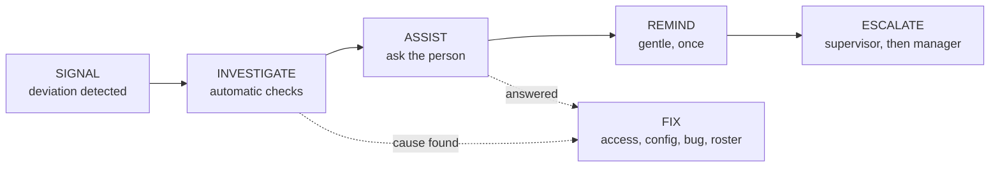

# 09 — Adoption Engine

> Status: Draft · Owner: Product + Platform · Data model: [14](14-data-model.md) §7 · Events: [13](13-event-architecture.md)
>
> **Policy first:** adoption measurement exists to find where the system is failing people, so they can be helped. It is **not a disciplinary instrument** (PR-ADO-07), and the UI, notifications and exports all reflect that.

---

## 1. Why not login counts

Logins prove presence, not operation. A supervisor can sign in daily and still post attendance on paper. The engine therefore measures **expected operational work actually executed through the company's systems**, where "the system" means DeployGuard ERP *or* the Platform — both count, because the goal is operating through systems, not using our app.

## 2. Expected Work Model

The denominator is derived, never guessed.

```
ExpectedWorkDefinition (tenant configuration)
  workflow_key      e.g. attendance.post
  applies_to        role + scope (site/team) or specific users
  source            roster | template schedule | erp_rule
  cadence           per shift | per day | per week | per event
  due_rule          e.g. shift_start + 30m, or 06:00 local
  fulfilment_rule   event pattern that proves it happened
  weight            relative importance (default 1)
```

Nightly (and on roster changes) the worker materialises `ExpectedWorkItem` rows for the coming window. Each resolves to:

| State | Meaning |
|---|---|
| `expected` | Should happen, not yet due |
| `fulfilled` | Proven by a matching event (`fulfilled_by_event_id`) |
| `missed` | Due passed with no matching event |
| `excused` | Legitimately not expected (below) |

**Excusal rules (fairness core):**

| Reason | Source |
|---|---|
| `leave` | Approved leave projection from ERP |
| `absence` | Attendance shows the person absent |
| `no_shift` | Roster has no shift for them |
| `reassigned` | Someone else covered per roster |
| `site_inactive` | Site archived/contract paused in ERP |
| `system_fault` | A support request or incident resolved as `platform_fault` / `erp_fault` covering that window — **applied retroactively**, restoring prior scores |
| `suppressed_by_admin` | Explicit, reasoned, audited exclusion |

## 3. Factors and score

Each factor is normalised to 0–100 over the window (default 7 days, with a 28-day view for trends).

| # | Factor | Weight | Formula | Signal it captures |
|---|---|---|---|---|
| F1 | **Workflow coverage** | 40 % | fulfilled ÷ (expected − excused) | Is the work happening in the system at all |
| F2 | **Timeliness** | 20 % | on-time fulfilments ÷ fulfilments | Is it happening when it matters |
| F3 | **Training & competency currency** | 15 % | 100 − penalty(overdue mandatory training, expired required competencies) | Is the person equipped |
| F4 | **Responsiveness** | 15 % | share of items acknowledged/verified within SLA (assignments, verifications, exception acknowledgements) | Do things move when they land on this person |
| F5 | **Reporting quality** | 10 % | 100 − rework rate (rejected verifications, incomplete submissions returned) | Is the work usable, not just submitted |

```
score = round( Σ (weight_i × factor_i) )
```

**Friction signals** (abandonments, client errors, "couldn't complete", difficulty ratings, problem reports, open support requests) are **not** a scored factor. They are attached to the snapshot as *explanations*, and they can trigger excusal (system fault) or remediation. A person hitting a broken screen must never score worse for it.

### Confidence

| Expected items in window (after excusal) | Confidence | Display |
|---|---|---|
| < 5 | Insufficient | No score shown: "Not enough activity yet" |
| 5–14 | Low | Score shown with a caution label; excluded from rankings/trends |
| 15–39 | Medium | Normal display |
| ≥ 40 | High | Normal display |

### Aggregation

Site, team, supervisor and tenant scores are computed from **their own expected items**, not as averages of person scores, so a site with many small items is not distorted by one person's tiny denominator. Supervisor-level score includes work they own *plus* verification responsiveness for their team.

## 4. Worked example

Site Supervisor, 7-day window:

| Factor | Raw | Normalised | Weighted |
|---|---|---|---|
| F1 coverage | 18 of 25 expected (2 excused for leave) → 18/23 = 78 % | 78 | 31.2 |
| F2 timeliness | 14 of 18 on time = 78 % | 78 | 15.6 |
| F3 training | 1 mandatory course overdue (−20) | 80 | 12.0 |
| F4 responsiveness | 9 of 10 verifications within SLA | 90 | 13.5 |
| F5 quality | 1 of 18 returned for rework = 5.6 % | 94 | 9.4 |
| **Score** | | | **82** |

Explanation panel shows: the 5 missed items (with links), the overdue course, the one rework, plus two friction signals (a permission error on Monday, one support request open) and the suggestion to resolve the support request before any follow-up with the person.

## 5. Silent abandonment detection

**Baseline:** per (user, workflow_key), an exponentially weighted fulfilment rate over the last 8 weeks, requiring ≥ 4 weeks of history and ≥ 10 expected items.

**Trigger** (either):

- trailing 5 working days' fulfilment ≤ 50 % of baseline, with ≥ 3 missed items; or
- ≥ 3 consecutive missed items in a workflow whose baseline was ≥ 80 %.

**Then, in order:**



**INVESTIGATE** (automatic, before contacting anyone):

| Check | If true |
|---|---|
| Approved leave / absence in window | Excuse items, close signal |
| Roster changed (no longer assigned) | Fix expectation definition, close signal |
| Permission or role changed | Raise exception to tenant admin ("access likely blocking work") |
| Open support request or repeated `client.error.shown` in that workflow | Link signal to support; suppress deductions pending outcome |
| ERP outage/stale projections in window | Excuse items |
| Device offline/not seen | Note in signal; ask about device in check-in |
| Someone else fulfilled the same real work | Expectation misconfigured → suggest owner change |

**ASSIST** — a short in-app check-in, written supportively:

> "We noticed the attendance posting for Site 12 hasn't come through since Monday. What's going on?"
> · I didn't know I had to · I couldn't find where · Something isn't working · I don't have permission · Someone else is doing it · I was away · Too busy / short-staffed · Other

| Answer | Automatic routing |
|---|---|
| Didn't know / couldn't find | Assign micro-lesson + link knowledge article; notify supervisor for context, not sanction |
| Something isn't working / no permission | Create support request with full context; suppress score deductions until resolved |
| Someone else is doing it | Task the tenant admin to correct the expectation owner |
| Was away | Excuse items (cross-checked with leave) |
| Too busy / short-staffed | Exception to the operations manager: capacity issue, not a personal failing |
| Other / no answer in 2 working days | Remind once, then escalate |

**ESCALATE:** supervisor after 2 working days without resolution; operations manager after 5, with the full evidence trail (what was missed, what was checked, what was asked, what was answered).

## 6. Recomputation and honesty

- Snapshots run nightly per tenant timezone; intraday updates recompute the current window on relevant events.
- Every snapshot stores `rule_version`; changing weights or definitions **does not silently rewrite history** — new versions apply forward, and any backfill is explicit, audited and labelled in the UI.
- Replay ([13](13-event-architecture.md) §9) rebuilds snapshots after a fix, with a visible note that figures were recomputed.

## 7. Configuration (tenant)

| Setting | Default |
|---|---|
| Window | 7 days (28-day trend) |
| Factor weights | 40/20/15/15/10 |
| Confidence thresholds | 5 / 15 / 40 |
| Abandonment sensitivity | 50 % of baseline, ≥ 3 missed |
| Check-in channel and tone | In-app + desktop, supportive template |
| Escalation delays | 2 and 5 working days |
| Visibility of own score to employees | On (subject to OQ-13) |
| Retroactive excusal on confirmed faults | On (not disableable) |

## 8. Fairness, anti-gaming and privacy

| Risk | Control |
|---|---|
| Score used for discipline | Policy statement in-product; export to HR/discipline blocked; audit on every cross-person view |
| "Ticking boxes" without doing the work | Auto-completion from ERP facts where possible; evidence requirements; verification sampling; manual completion of auto-completable items flagged |
| Gaming by suppressing expectations | Suppression requires reason + audit; supervisors cannot suppress their own items |
| Punishing people for broken software | Friction signals never deduct; confirmed faults excuse retroactively |
| Small-sample unfairness | Confidence gating; no rankings below Medium confidence |
| Surveillance perception | Monitoring notice acknowledged at first sign-in; no keystroke/screen/location capture; employees see their own data |
| Manager pressure loops | Notifications about a person go to the person first; supervisors are shown *support* actions before escalation options |

## 9. MVP scope for DogForce

Five workflows, chosen because they are where work currently escapes the system:

| `workflow_key` | Who | Cadence | Fulfilment proof |
|---|---|---|---|
| `attendance.post` | Site supervisor per site | Per shift-day, due at cut-off | `odoo.attendance.batch.submitted` |
| `incident.review` | Ops officer / manager | Per ERP incident ≥ threshold, SLA 24 h | `odoo.incident.state_changed → reviewed` |
| `site.visit` | Site supervisor | Weekly per site | `work.checklist.submitted` (+ verification) |
| `training.mandatory` | All desktop users | Per assignment due date | `training.course.completed` |
| `shift.handover` | Site supervisor | Per shift change (V1 template, phased in) | `work.checklist.submitted` |

Guards are measured **only** through site-level coverage derived from ERP events (attendance, patrol/incident records), never through desktop telemetry (C-10).
