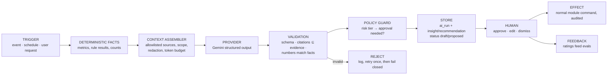

# 11 — AI Intelligence Layer

> Status: Draft · Owner: Platform architecture · Decision: [DG-ADR-010](adr/DG-ADR-010-ai-architecture.md) · **Gemini is the default provider (R-4)**
>
> AI is an intelligence layer, not a chatbot and not an autonomous actor. It interprets, summarises, classifies, prioritises and drafts — always over evidence the system already holds, always reviewable.

---

## 1. Division of labour

| Deterministic (rules, metrics, SQL) | AI (Gemini by default) |
|---|---|
| Is this task overdue? Is the post uncovered? | Why does this site keep missing attendance posts? |
| What is the adoption score and which factors moved? | What does this pattern suggest we should do next? |
| Which exceptions are open, and what are their SLAs? | Which of these deserves attention first, and why? |
| Did this assessment pass? | Which mistakes cluster, and which refresher fits? |
| What happened this week (facts, counts, deltas)? | A readable brief of what it means, citing those facts |

**Hard rule:** no AI output may change a fact. If the model and the rules disagree about a number, the rules win and the output is rejected.

## 2. Pipeline

## 3. Context assembly (never a database dump)

Each capability declares an allowlist of **context providers** — typed functions returning small, structured, already-authorised data:

| Provider | Returns |
|---|---|
| `adoption.snapshotDeltas(subject, window)` | Factor values and deltas with evidence refs |
| `expectedWork.missedItems(subject, window)` | Missed items with times and workflow keys |
| `exceptions.openSummary(scope)` | Open exceptions: rule, severity, age, owner |
| `work.reworkSummary(subject, window)` | Rejections with reason codes |
| `feedback.recent(subject|scope, window)` | Categories and counts (no free text unless the capability is support-scoped and the author consented) |
| `support.openRequests(scope)` | Status, category, age |
| `training.statusSummary(subject)` | Overdue/expiring, failed attempts with mistake tags |
| `erp.contextSummary(scope)` | Coverage, roster gaps, incident counts from projections |
| `knowledge.search(query, scope)` | Approved article snippets (V1: semantic via pgvector) |
| `system.health(scope, window)` | Outages/stale data that might explain behaviour |

Rules:

- **Scope-bound:** providers run with the *requesting user's* authorisation; an AI answer can never reveal what the user could not read directly.
- **Redaction:** national IDs, contact details, bank data, medical and disciplinary narratives are never included. People appear as display name + role + ID.
- **Budgeted:** each capability has a token budget; providers truncate deterministically (most recent, highest severity first) and the omission is stated in the prompt.
- **Cited:** every fact enters context with an `evidence_id`; outputs must cite these IDs.
- **Tenant-isolated:** retrieval and embeddings never cross tenants ([15](15-multi-tenancy.md) §6).

## 4. Proactive capabilities

Each capability is specified with the seven required attributes.

### 4.1 `adoption.drop.explain` (V1)

| Attribute | Specification |
|---|---|
| **Trigger** | `adoption.score.changed` with drop ≥ 10 points and Medium+ confidence, or site coverage drop ≥ 15 points |
| **Data** | Snapshot deltas, missed items, friction signals, support requests, roster/role changes, system health for the window |
| **Reasoning** | Correlate the drop with candidate causes; distinguish "person stopped" from "system blocked them" from "expectation misconfigured" |
| **Output** | ≤ 120-word explanation, ranked candidate causes with confidence, one recommended next step, citations |
| **Confidence** | From data sufficiency, agreement between signals, and recency |
| **Human action** | Manager/supervisor reads in the exception; may start a check-in, open the support request, or fix the expectation |
| **Audit** | `ai_run` + insight attached to the exception timeline |

### 4.2 `inbox.prioritise` (V1)

Trigger: inbox opened / hourly. Data: open exceptions with rule, severity, age, scope, recurrence, related coverage. Reasoning: order *within* severity bands by operational risk and staleness. Output: ordering plus a one-line "why now" per top item, citing evidence. Confidence: per item. Human action: none required — ordering only; severity itself is never changed by AI. Audit: run recorded; ordering is explainable on demand.

### 4.3 `brief.weekly` (V1) / `brief.daily` (V1, ops manager)

Trigger: schedule (tenant timezone). Data: deterministic metrics, exception summary, adoption movement, training compliance, support themes, notable ERP facts. Reasoning: summarise, compare with the previous period, surface risks and positives. Output: the structure below, every quantitative claim citing a metric or event:

> **What happened** · **What needs attention** · **What changed** · **Risks** · **Recommended actions** · **Positive developments**

Confidence: stated per risk claim. Human action: owner reads; recommended actions can be turned into tasks with one click. Audit: stored and linked from the digest.

### 4.4 `feedback.classify` (V1)

Trigger: `feedback.problem.reported`. Data: category, screen route, workflow, error code, recent client errors, article candidates. Reasoning: map to a canonical issue type, detect duplicates of known issues, suggest a knowledge article. Output: issue type, duplicate-of, suggested article, suggested priority. Human action: support agent confirms; misclassification is one click to correct (and feeds evals). Audit: on the support request.

### 4.5 `support.assist` (V1)

Trigger: user asks for help in context. Data: user role, current screen/workflow, their recent errors, relevant knowledge articles, their permissions. Reasoning: answer from approved articles only; if unsupported, say so and offer to create a request. Output: answer with citations, or explicit "I can't answer this — create a request?". Human action: user; escalation to human support. Audit: transcript stored, rated.

### 4.6 `training.gap.recommend` (V1 rules-assisted, V2 adaptive)

Trigger: repeated failures, rework reasons, or exception clusters for a person or role. Data: mistake tags, rework codes, exception rule ids, existing courses. Reasoning: map clusters to existing content; propose a refresher. Output: recommended assignment (person/role, course, reason), or "no suitable content — consider authoring X". Human action: HR/manager approves the assignment. Audit: recommendation record.

### 4.7 `workflow.recurring_problem` (V1)

Trigger: weekly, plus `support.recurring_issue`. Data: friction signals, abandonment points, support categories, rework reasons grouped by workflow and screen. Reasoning: identify where the process (not the person) fails. Output: ranked list of workflow pain points with affected counts and a suggested fix class (training, configuration, permission, product defect). Human action: tenant admin/manager triages; product defects become platform issues. Audit: stored.

### 4.8 `site.behaviour.unusual` (V2)

Trigger: nightly. Data: site-level operational patterns over 90 days (coverage, incidents, attendance anomalies, patrol confirmations). Reasoning: flag statistically unusual patterns for human review. Output: flagged sites with the pattern described and evidence. Confidence: explicit; low-confidence flags are not shown. Human action: ops manager reviews. Audit: stored. **Never** produces conclusions about individuals.

### 4.9 `content.draft` (V2)

Trigger: author requests a draft from an approved SOP/article. Data: the source document, target role, existing course style. Reasoning: restructure into lessons and questions with mistake tags. Output: draft course version, always `draft`, labelled as generated with sources. Human action: approver (Winston, R-8) reviews and publishes. Audit: full.

## 5. Confidence and evidence

- **Confidence** is computed by the Platform from: data sufficiency (volume and window), signal agreement (do independent sources point the same way), recency, and historical accuracy of that capability (from user ratings). The model's own hedging is recorded but never the sole basis.
- Displayed as **Low / Medium / High** with the reason ("based on 6 events over 5 days; one contradicting signal").
- Every insight shows **"Why am I seeing this?"** listing the evidence with links. If a user cannot open a cited item, it is not shown — a scope violation is a bug, and citations are checked against the user's own permissions at render time.

## 6. Guardrails

| Guardrail | Enforcement |
|---|---|
| No invented numbers | Output validation compares every numeric claim against the facts block; mismatch → reject |
| No uncited claims | Every assertion sentence must map to ≥ 1 evidence id; uncited → reject |
| No new facts about people | Outputs about individuals restricted to work events already in evidence |
| No consequences | AI cannot discipline, terminate, alter HR records, change policy, modify ERP financial data, or execute Odoo commands ([12](12-odoo-integration.md) §8) |
| Approval required | `proposal` risk tier requires an authorised human; `draft` content requires the content approver |
| Refusal is valid | Insufficient evidence → "Not enough information", never speculation |
| Tenant control | Any capability can be disabled per tenant; disabling AI never disables a deterministic feature |
| Budget | Monthly cost cap per tenant/capability; exceeding disables non-critical capabilities with notice |

## 7. Governance of prompts and models

- Prompt templates are versioned files; a change requires the capability's eval set to pass in CI.
- Model selection is configuration (`ai_model_catalog` + tenant override); feature code never names a model.
- Eval sets combine synthetic fixtures and (with consent) anonymised real cases, checking: schema validity, citation integrity, numeric fidelity, refusal on thin evidence, and tone for employee-facing text.
- Quality is monitored in production through approval/rejection rates and user ratings; a capability whose rejection rate exceeds 30 % is disabled pending review.

## 8. Relationship to the ERP AI engine

`security_ai_engine` remains inside DeployGuard ERP for in-Odoo record features, and must be switched to its correct Gemini default (defect D-1, rollout Stage 0). The Platform does not call it, and it does not call the Platform. Convergence — Odoo delegating to Platform capabilities through the bridge — is an open question for V1 (OQ-3).
