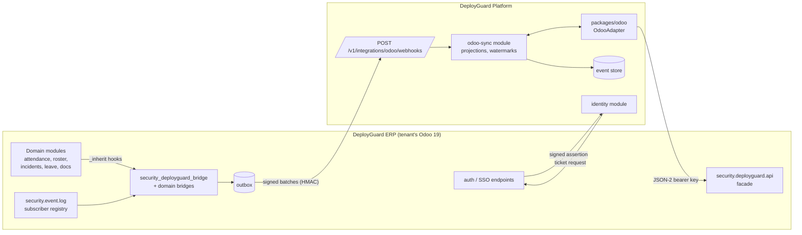

# 12 — Odoo Integration

> Status: Draft · Owner: Platform architecture
>
> Decisions: [DG-ADR-006](adr/DG-ADR-006-odoo-integration.md) (push + pull, JSON-2, facade), [DG-ADR-007](adr/DG-ADR-007-authentication.md) (single login, SSO tickets), [DG-ADR-018](adr/DG-ADR-018-odoo-bridge-addons.md) (bridge addons). This document is the implementation-level specification.

---

## 1. Integration at a glance



## 2. Connection setup (tenant onboarding)

| Step | Where | Performed by |
|---|---|---|
| 1 | Install `security_deployguard_bridge` (+ auto-installed domain bridges) on the tenant database | Tenant admin / implementation partner (per-client module baseline, [26](26-deployment-strategy.md)) |
| 2 | Odoo Settings → DeployGuard: enter Platform URL and tenant ID; generate signing keypair; generate webhook secret | Odoo admin |
| 3 | Bridge creates `DeployGuard Integration` internal user in `group_deployguard_integration` only; admin generates an API key for it (Odoo user API keys) | Odoo admin |
| 4 | Platform Admin → Integrations → Odoo: enter Odoo base URL, database, integration API key, webhook secret; paste bridge public key (`kid`) | Tenant admin (Platform) |
| 5 | Platform runs **connection test**: JSON-2 `security.deployguard.api.ping`, signature round-trip, webhook test event, clock-skew check (≤ 60 s) | System |
| 6 | Initial sync: sites → employees/users → roster (−7 d … +14 d) → attendance (−30 d) → open incidents → leave (−30 d … +60 d) → open alerts | System (worker) |
| 7 | Identity linking: enable DeployGuard access on selected Odoo users; first sign-in creates the link ([§6](#6-identity-mapping)) | Tenant admin + users |

All secrets entered in step 4 are envelope-encrypted ([15](15-multi-tenancy.md) §5). Rotation is supported for the API key, webhook secret (dual-secret window of 24 h) and signing key (`kid` overlap).

## 3. Facade API (Platform → Odoo, JSON-2)

Called as `POST {odoo}/json/2/security.deployguard.api/<method>` with `Authorization: Bearer <integration API key>`. Each call runs in its own Odoo transaction.

| Method | Parameters | Returns | Used for | Release |
|---|---|---|---|---|
| `ping` | — | `{version, contract, db, server_time, modules: {...}}` | Health, contract negotiation, installed-bridge discovery | MVP |
| `get_sites` | `since?`, `limit`, `cursor` | Sites/posts: id, name, client, active, region, write_date | `SiteProjection` | MVP |
| `get_employees` | `since?`, `limit`, `cursor` | Employee id, name, job/grade, site assignments, active, parent_id, user_id, write_date (no private HR fields) | `EmployeeProjection`, reporting-line suggestions | MVP |
| `get_users` | `ids?`, `since?` | res.users id, login, name, email, active, share, relevant groups, deployguard_access, totp_enabled, write_date | Identity link, drift, revocation polling | MVP |
| `get_roster` | `site_ids?`, `date_from`, `date_to`, `since?` | Roster slots: id, site, post, shift start/end, employee, state, batch state, write_date | `ShiftProjection`, expected work | MVP |
| `get_attendance_batches` | `date_from`, `date_to`, `since?` | Batch id, site, date, shift, state (draft/captured/reviewed/locked), responsible user, submitted_at, write_date | Expected-work fulfilment, exceptions | MVP |
| `get_attendance_summary` | `batch_ids` | Counts per presence value (present/absent/awol/not_marked) | Exceptions, site health | MVP |
| `get_incidents` | `since?`, `state?` | Incident id, type, severity, state, site, reported_by, reviewer, created/reviewed dates, write_date (no free-text narrative by default) | Expected review work, exceptions | MVP |
| `get_leave` | `date_from`, `date_to`, `since?` | Approved/cancelled leave per employee and range | Expected-work exclusions | MVP |
| `get_open_alerts` | `since?` | `security.notification` rows: type, severity, related model/id, company, created | Exception signals (C-5) | MVP |
| `get_certifications` | `employee_ids?`, `since?` | Certification type, issue/expiry, expired flag | Competency context, expiry exceptions | V1 |
| `create_employee_certification` | `idempotency_key`, employee, type, issue/expiry, evidence ref | Created id | Approved Platform certification → ERP (C-7) | V1 |
| `post_record_note` | `idempotency_key`, model, id, body (plain text, ≤ 2 000 chars) | Message id | Link exception resolution to ERP record | V1 |

**Rules**

- Pagination by opaque cursor, `limit` ≤ 500.
- `since` filters on `write_date > since`, combined with id tiebreak.
- Field allowlists are defined in the facade. Adding a field is a bridge release with a contract version bump when breaking.
- The integration user holds no ACL on domain models beyond what facade methods need, invoked with the minimum elevation required *inside* each method. Every elevated read is explicitly scoped (reviewed against S-6).

## 4. Webhook events (Odoo → Platform)

**Endpoint:** `POST {platform}/v1/integrations/odoo/webhooks`

**Headers:** `X-DG-Tenant`, `X-DG-Contract: v1`, `X-DG-Signature: t=…,v1=…`, `X-DG-Delivery-Id`

**Body:** `{ "events": [ …≤200 ] }`

Each event (bridge-side envelope, converted to a Platform event on ingestion, see [13](13-event-architecture.md) §5):

```json
{
  "event_id": "0192f0c8-6f7a-7c21-9d3e-1b5a2c3d4e5f",
  "type": "attendance.batch.submitted",
  "version": 1,
  "occurred_at": "2026-09-16T05:42:10Z",
  "odoo": { "model": "security.attendance.batch", "res_id": 8812, "write_date": "2026-09-16T05:42:10Z" },
  "actor": { "odoo_uid": 57 },
  "data": { "site_id": 212, "shift_date": "2026-09-15", "shift": "night", "state": "captured", "counts": { "present": 11, "absent": 1, "awol": 0, "not_marked": 0 } },
  "correlation_id": "0192f0c8-6f6e-7a11-8c3d-aa11bb22cc33"
}
```

**MVP event catalogue from bridges**

| Bridge addon | Odoo trigger | Event type (bridge) | Platform type |
|---|---|---|---|
| core | `res.users` `active` → False | `identity.user.deactivated` | `odoo.identity.user.deactivated` |
| core | password changed | `identity.user.password_changed` | `odoo.identity.user.password_changed` |
| core | TOTP enabled/disabled | `identity.user.totp_changed` | `odoo.identity.user.totp_changed` |
| core | DeployGuard access flag removed | `identity.access.revoked` | `odoo.identity.access.revoked` |
| roster | batch published | `roster.batch.published` | `odoo.roster.batch.published` |
| roster | slot employee assigned or changed | `roster.slot.assigned` | `odoo.roster.slot.assigned` |
| roster | slot unfilled at publish or later unassigned | `roster.slot.unfilled` | `odoo.roster.slot.unfilled` |
| attendance | batch created | `attendance.batch.created` | `odoo.attendance.batch.created` |
| attendance | batch → captured | `attendance.batch.submitted` | `odoo.attendance.batch.submitted` |
| attendance | batch → reviewed | `attendance.batch.reviewed` | `odoo.attendance.batch.reviewed` |
| attendance | batch → locked | `attendance.batch.locked` | `odoo.attendance.batch.locked` |
| attendance | record check-in / check-out captured | `attendance.record.checked_in` / `checked_out` | `odoo.attendance.record.checked_in` / `checked_out` |
| attendance | bus `attendance.missed` | `attendance.missed` | `odoo.attendance.missed` |
| incidents | incident created | `incident.created` | `odoo.incident.created` |
| incidents | state change (draft → approved → resolved) | `incident.state_changed` | `odoo.incident.state_changed` |
| leave | leave approved / cancelled | `leave.approved` / `leave.cancelled` | `odoo.leave.approved` / `odoo.leave.cancelled` |
| notifications | `security.notification` created | `alert.raised` | `odoo.alert.raised` |
| compliance (V1) | certification/document expiring or expired | `compliance.document.expiring` | `odoo.compliance.document.expiring` |

**Ingestion processing**

1. Verify timestamp freshness (≤ 5 min skew) and HMAC with the current or previous secret. Reject → 401 plus a health counter.
2. Validate the contract version and each event schema. Unknown types are stored as `unrecognised` (dead-letter view), not dropped silently.
3. Insert Platform events with `idempotency_key = odoo:{event_id}`; duplicates are no-ops.
4. Respond `202` with per-event acceptance; the bridge marks rows sent.
5. Consumers update projections, expected-work fulfilment, exceptions and session revocation.

## 5. Polling reconciliation

| Entity | Interval | Window |
|---|---|---|
| Users (identity) | 5 min | `since` watermark |
| Roster (current day ± 1) | 1 min during 05:00–22:00 tenant time, else 5 min | Date range + `since` |
| Roster (future) | 30 min | +14 days |
| Attendance batches | 2 min (current and previous day) | Date range + `since` |
| Incidents | 5 min | `since` |
| Leave | 30 min | `since` |
| Sites, employees | 60 min | `since` |
| Open alerts | 5 min | `since` |

- Watermarks live in `sync_watermark(tenant_id, entity, last_write_date, last_id, updated_at)`.
- Polling emits **the same Platform event types** when it detects a state change not seen via webhook, marked `source.channel = "poll"`. Downstream consumers stay identical.
- Circuit breaker opens after 5 consecutive failures; retries with exponential backoff; the tenant health status degrades to "Odoo unreachable" (a banner for tenant admins, and in-app for users of Odoo-dependent actions).

## 6. Identity mapping

| Link | Source of truth | Creation | Change handling |
|---|---|---|---|
| Platform `user` ↔ Odoo `res.users` | Verified sign-in assertion (`sub`) | First successful sign-in of a user with DeployGuard access | Deactivation, password or TOTP change events → revoke sessions |
| Platform `user` ↔ Odoo `hr.employee` | `res.users.employee_ids` via `get_users` / assertion `emp` | Auto-linked when exactly one employee exists; otherwise the admin chooses | Employee changes via polling |
| Guard (non-user) ↔ `hr.employee` | `EmployeeProjection` | Initial sync | Polling; guards are *subjects* of events, not Platform users (MVP) |
| Site ↔ `security.client.site` / posts | `SiteProjection` | Initial sync | Polling; archived in Odoo → archived projection |
| Reporting line suggestion | `hr.employee.parent_id` | Initial sync | Suggestion only; Platform lines are authoritative |

## 7. Deep links and opening Odoo

- `OdooAdapter.buildDeepLink(target)` supports `{ action: xmlid, res_id? }`, `{ model, res_id }` and `{ menu: xmlid }`. It produces Odoo 19 web client URLs.
- The Platform requests an SSO ticket for the user and target ([DG-ADR-007](adr/DG-ADR-007-authentication.md) §4). The desktop opens a **dedicated Odoo window** (single reusable window, navigated per request); the web app opens a new tab.
- **Common targets for MVP:**
  - attendance posting console (`security_attendance.posting_console`) for a batch;
  - attendance batch form;
  - incident form;
  - roster board for a site and week;
  - employee form (managers and HR only).

## 8. Write-back (V1) and command log

- Only facade commands listed in §3.
- The Platform `IntegrationCommand` row (`idempotency_key`, `command`, `payload hash`, `status`, `odoo_result_id`) is created before the call. Retries reuse the key, and the bridge returns the original result for a duplicate key.
- Every command requires a human-approved origin: a certification approved by an authorised role, or an exception resolution by its owner. AI never triggers commands directly ([11](11-ai-intelligence.md) §8).

## 9. Failure matrix

| Failure | Detection | Behaviour | User-visible |
|---|---|---|---|
| Odoo down | Poll/circuit breaker, `/ping` | Projections frozen with `stale_since`; exception rules depending on fresh Odoo data **pause** rather than raise false exceptions | Banner: "Odoo data last updated 09:12"; Open in Odoo disabled with reason |
| Webhooks not arriving | Webhook lag > 10 min while poll finds changes | Poll continues; health alert to tenant admin | Admin health page |
| Signature failures | 401 counter | Alert platform ops; possible secret mismatch | Admin health page |
| Contract mismatch | `X-DG-Contract` unsupported | Reject with health alert | Admin |
| Integration API key revoked | 401 from JSON-2 | Pause sync; alert admin | Admin + banner |
| Odoo restored from backup (time travel) | `write_date` regressions or missing records | Reconcile full window; mark projections; flag dependent exceptions for review | Admin notice |
| Clock skew > 60 s | Ping comparison | Warn; SSO tickets and assertions may fail | Admin |

## 10. DogForce specifics (configuration, not code)

- **Installed ERP modules** ([00](00-current-state.md) §3.1) support all MVP bridges: attendance, roster (operations), incidents (discipline), leave, notifications. `security_documents` is installed, so the compliance bridge is available in V1.
- **Prerequisites** (rollout Stage 0, [31](31-dogforce-rollout.md)):
  - HTTPS on the Odoo domain;
  - the proxy question (OQ-16);
  - Odoo internal users for pilot staff (OQ-8);
  - the DeployGuard ERP staging environment running again for Platform staging.
