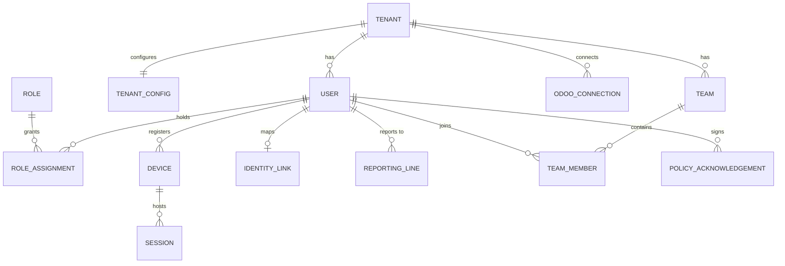
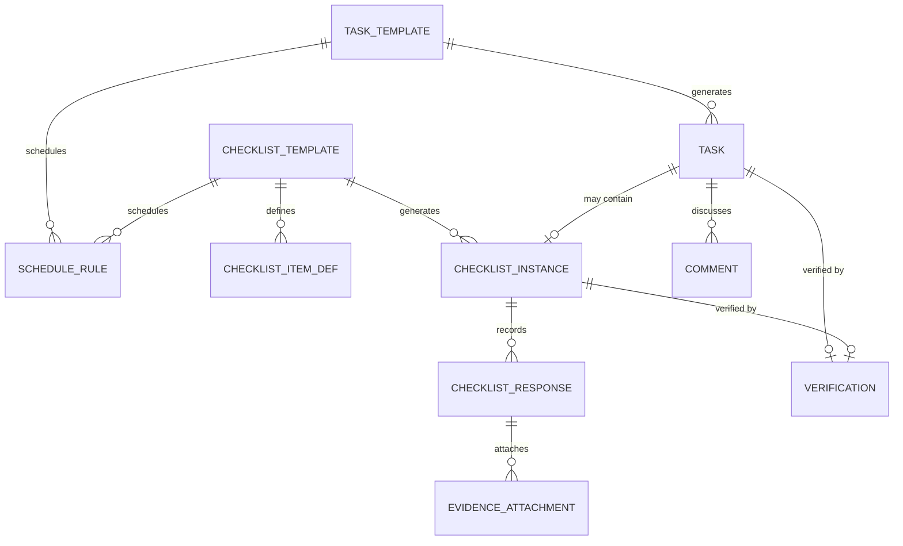
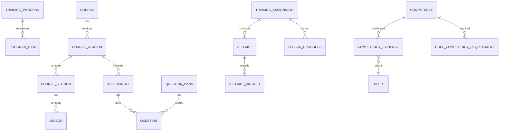

# 14 — Conceptual Data Model

> Status: Draft · Owner: Platform architecture
>
> Conceptual model: bounded contexts, aggregate roots, key entities and ownership. Physical schema (columns, indexes, RLS policies) lives in the Platform repo migrations. Every tenant-owned table carries `tenant_id` ([15](15-multi-tenancy.md)).

---

## 1. Bounded contexts

| Context | Owns | Aggregate roots |
|---|---|---|
| **Tenancy & Identity** | Tenants, configuration, users, roles, scopes, teams, reporting lines, devices, sessions | `Tenant`, `User`, `Team`, `Device` |
| **ERP Integration** | Odoo connection, projections of ERP facts, sync state, commands | `OdooConnection`, each `*Projection` (read model) |
| **Work** | Templates, recurrence, tasks, checklist instances, evidence, verification | `TaskTemplate`, `ChecklistTemplate`, `Task`, `ChecklistInstance` |
| **Training** | Programs, courses and versions, lessons, assessments, assignments, attempts | `TrainingProgram`, `Course`, `Assessment`, `TrainingAssignment`, `Attempt` |
| **Competency** | Framework, requirements, evidence, status, Platform certifications | `CompetencyFramework`, `CompetencyEvidence`, `PlatformCertification` |
| **Adoption** | Expected work, snapshots, factors, abandonment signals, check-ins | `ExpectedWorkDefinition`, `AdoptionSnapshot`, `AbandonmentSignal` |
| **Exceptions** | Rules, exceptions, evidence, timeline, escalation policies | `ExceptionRule`, `Exception`, `EscalationPolicy` |
| **Notifications** | Intents, notifications, deliveries, preferences, digests | `Notification`, `NotificationPreference` |
| **Feedback & Support** | Feedback, support requests, messages | `Feedback`, `SupportRequest` |
| **Knowledge** | Articles and versions, targeting | `KnowledgeArticle` |
| **Intelligence** | Capability config, runs, insights, recommendations | `AIRun`, `AIRecommendation` |
| **Platform core** | Events, checkpoints, audit, files | `Event`, `AuditLog`, `FileObject` |

## 2. Review of the brief's entity list

| Brief entity | Decision |
|---|---|
| Tenant, User, Role, Team, Site, Device, Session | Kept. `Site` is an **ERP projection** plus a Platform-owned `SiteSettings`. |
| Permission | **Not a table.** Permissions are code-defined constants; `Role` maps to permission sets, custom roles store the set. |
| Task, TaskTemplate, Checklist, ChecklistTemplate | Kept, with `Checklist` renamed `ChecklistInstance` (template vs instance must never be ambiguous). |
| Workflow, WorkflowInstance | Kept, **V1** (MVP uses templates + recurrence only). |
| TrainingProgram, Course, Module, Lesson | Kept; `Module` renamed **`CourseSection`** to avoid collision with software modules. |
| Assessment, Question, Attempt | Kept; added `QuestionBank`, `AttemptAnswer`. |
| Competency, Certification, TrainingAssignment | Kept; `Certification` split into `PlatformCertification` (Platform-issued) and `CertificationProjection` (legal certificates from Odoo). |
| Feedback, SupportRequest | Kept; added `SupportMessage`. |
| Event, Exception, Notification, Escalation | Kept, except `Escalation` folded into `ExceptionTimelineEntry` + `EscalationPolicy` (escalation is a step in a policy, not an independent aggregate). |
| AIInsight, AIRecommendation | Kept; added `AIRun` (the audited call) and `AICapabilityConfig`. |
| AuditLog | Kept. |
| OdooConnection, OdooMapping, IntegrationSync | `OdooConnection` kept; `OdooMapping` becomes `IdentityLink` + the `odoo_id` keys on projections; `IntegrationSync` becomes `SyncWatermark` + `SyncRun` + `WebhookDelivery`. |
| **Added** | `ExpectedWorkDefinition`, `ExpectedWorkItem`, `AdoptionSnapshot`, `ScoreFactor`, `AbandonmentSignal`, `CheckIn`, `EvidenceAttachment`/`FileObject`, `KnowledgeArticle`, `ReportingLine`, `RoleAssignment` (with scope), `ScheduleRule`, `ContentVersion`, `PolicyAcknowledgement`, `IntegrationCommand`, `EventConsumerCheckpoint`. |

## 3. Tenancy & Identity

| Entity | Key fields | Notes |
|---|---|---|
| `Tenant` | name, company_code, status, locale, timezone, currency, created_at | Platform-global table |
| `TenantConfig` | branding (font/accent from ERP theme), working calendar, feature flags, AI budget, retention overrides | JSONB, versioned |
| `User` | display_name, email, phone?, status, locale, last_seen_at | **No password hash for tenant users** ([DG-ADR-007](adr/DG-ADR-007-authentication.md)) |
| `IdentityLink` | user_id, odoo_connection_id, odoo_uid, odoo_employee_id?, linked_at, drift_flags | Unique per (connection, odoo_uid) |
| `Role` | key, name, is_custom, permission_set | Catalogue roles seeded per tenant |
| `RoleAssignment` | user_id, role_id, scope_type (`tenant\|site\|team\|self`), scope_id, valid_from/to | Multiple per user |
| `Team` / `TeamMember` | name, purpose; user_id, role_in_team | Teams are Platform-owned groupings |
| `ReportingLine` | user_id, manager_user_id, scope_site_id?, source (`manual\|odoo_suggested`) | Authoritative for escalation |
| `Device` | user_id, public_key, platform, app_version, last_seen, status | Ed25519 device key |
| `Session` | user_id, device_id, refresh_family_id, amr, auth_time, expires_at, revoked_at/reason | Rotating refresh tokens |
| `PolicyAcknowledgement` | user_id, policy_key (e.g. `adoption_monitoring_notice`), version, acknowledged_at | Privacy notice evidence (OQ-6) |

## 4. ERP integration (read models)

| Entity | Source Odoo model | Platform use |
|---|---|---|
| `OdooConnection` | — | base_url, db, encrypted API key, webhook secret ref, bridge public keys, contract version, health |
| `SiteProjection` | `security.client.site` (+ posts) | Scope, site screens, expected work |
| `SiteSettings` | **Platform-owned** | Per-site expectations, checklist templates, escalation overrides |
| `EmployeeProjection` | `hr.employee` | Guards and staff context, reporting suggestions |
| `ShiftProjection` | `security.roster.slot` | Shift-based recurrence, expected work, coverage |
| `AttendanceBatchProjection` | `security.attendance.batch` | Expected work fulfilment, exceptions |
| `IncidentProjection` | `security.incident` | Review work, exceptions |
| `LeaveProjection` | `security.leave.request` | Expected-work exclusions |
| `AlertProjection` | `security.notification` | Exception signals |
| `CertificationProjection` | `security.employee.certification` | Competency context, expiry exceptions |
| `SyncWatermark` / `SyncRun` / `WebhookDelivery` | — | Sync state, lag metrics, dead letters |
| `IntegrationCommand` | — | Allowlisted write-backs with idempotency |

All projections: `odoo_id`, `odoo_write_date`, `content_hash`, `synced_at`, `stale_since?`. **Read-only to the rest of the Platform.**

## 5. Work

| Entity | Key fields |
|---|---|
| `TaskTemplate` / `ChecklistTemplate` | key, title, description, domain_kind (`site_visit\|handover\|attendance_post\|incident_review\|generic`), version, status (`draft\|published\|retired`), verifier_rule, evidence_required, sla |
| `ChecklistItemDef` | order, prompt, type (`yes_no\|choice\|number\|text\|photo\|file\|signature`), required, choices, min/max, guidance, help_article_ref |
| `ScheduleRule` | mode (`calendar\|shift\|site_event`), rrule / shift filter (site, post type, shift window), assignee_rule (`role_at_site\|specific_user\|slot_employee`), lead_time, due_offset, active_from/to |
| `Task` | template_id?, title, assignee_user_id, scope (site/team), due_at, priority, status (`open\|in_progress\|submitted\|verified\|rejected\|could_not_complete\|cancelled`), linked_odoo_ref?, auto_complete_rule?, completed_at, source (`template\|manual\|system`) |
| `ChecklistInstance` | template_id, template_version, task_id?, site_id?, shift_ref?, status, started_at, submitted_at, required_missing |
| `ChecklistResponse` | item_def_id, value JSONB, answered_at, offline_command_id? |
| `EvidenceAttachment` | file_object_id, kind, captured_at, hash |
| `Verification` | verifier_user_id, outcome (`approved\|rejected`), reason, verified_at, competency_evidence_id? |
| `Comment` | author, body, created_at |

## 6. Training & competency

| Entity | Key fields |
|---|---|
| `TrainingProgram` / `ProgramItem` | key, audience (roles), items (courses in order), mandatory, due_offset_days |
| `Course` / `CourseVersion` | key, title, category, owner, version_no, status (`draft\|in_review\|published\|retired`), approved_by (R-8), published_at, changelog |
| `CourseSection` / `Lesson` | title, order; lesson type (`rich_text\|video\|document\|walkthrough`), content_ref, estimated_minutes, offline_available |
| `Assessment` / `Question` / `QuestionBank` | pass_mark, attempt_limit, shuffle; question type, stem, options, correct, explanation, `skill_tags[]`, `mistake_tags[]` (adaptive input) |
| `TrainingAssignment` | user_id, course_id (+ pinned version), assigned_by, reason (`role\|manual\|refresher\|remediation`), due_at, mandatory, status |
| `LessonProgress` / `Attempt` / `AttemptAnswer` | position, completed_at; score, passed, attempt_no, started/submitted; per-answer correctness and tags |
| `CompetencyFramework` / `Competency` | name; key, description, levels (0–4 definitions), evidence_types, validity_months |
| `RoleCompetencyRequirement` | role_key, competency_id, required_level, grace_days |
| `CompetencyEvidence` | user_id, competency_id, type (`assessment\|practical\|observation\|erp_record`), source_ref (attempt, verification, projection), verifier_user_id?, level_awarded, recorded_at, expires_at? |
| `CompetencyStatus` (derived) | user_id, competency_id, current_level, valid_until, gap_vs_requirement |
| `PlatformCertification` | user_id, competency_set, issued_by, issued_at, expires_at, odoo_pushed_ref? (C-7) |

## 7. Adoption

| Entity | Key fields | Notes |
|---|---|---|
| `ExpectedWorkDefinition` | workflow_key, applies_to (role/scope), source (`roster\|template\|erp_rule`), cadence, due_rule, fulfilment_rule (event pattern), weight, active | Tenant configuration |
| `ExpectedWorkItem` | definition_id, subject_user_id?, subject_site_id?, period (date), due_at, state (`expected\|fulfilled\|missed\|excused`), fulfilled_by_event_id?, excused_reason (`leave\|absence\|no_shift\|suppressed`) | Materialised nightly and on roster changes |
| `AdoptionSnapshot` | subject_type (`user\|site\|team\|supervisor\|tenant`), subject_id, date, window (`7d\|28d`), score, confidence, expected_count, sufficient_data | Daily |
| `ScoreFactor` | snapshot_id, factor_key, raw_value, normalised, weight, contribution, delta_vs_prev, evidence_refs[] | Explainability |
| `AbandonmentSignal` | subject_user_id, workflow_key, baseline_rate, observed_rate, window, state (`suspected\|assisting\|resolved\|escalated\|false_positive`), opened_at | |
| `CheckIn` | signal_id, question_set, sent_at, answered_at, answer_code, free_text?, routed_to | "What happened?" flow |

## 8. Exceptions, notifications, feedback, knowledge, intelligence

| Entity | Key fields |
|---|---|
| `ExceptionRule` | rule_id, name, category, severity_default, condition (typed config), owner_rule, escalation_policy_id, dedupe_window, enabled, thresholds |
| `Exception` | rule_id, severity, subject, scope, owner_user_id/role_at_scope, status (`open\|acknowledged\|in_progress\|resolved\|dismissed`), opened_at, due_at, resolved_at, resolution_code, recurrence_count |
| `ExceptionEvidence` | exception_id, kind (`event\|projection\|metric\|feedback`), ref, captured_value |
| `ExceptionTimelineEntry` | exception_id, at, actor, kind (`raised\|note\|assigned\|escalated\|notified\|status_changed\|ai_insight`), payload |
| `EscalationPolicy` | steps[] (delay, audience, channel, severity_bump), cancel_on |
| `Notification` | recipient_user_id, category, severity, title, body_ref, route, dedupe_key, created_at, read_at, acted_at |
| `NotificationDelivery` | notification_id, channel, status, provider_ref, error, delivered_at, opened_at |
| `NotificationPreference` | user_id, category, channel, mode (`immediate\|digest\|off` — `off` blocked for critical), quiet_hours |
| `Feedback` | user_id, subject_ref, kind (`task_rating\|problem`), rating/category, context JSONB (screen, task, odoo ref, error code, app version), created_at |
| `SupportRequest` / `SupportMessage` | requester, category, status, priority, assignee, sla_due, resolution_code, linked_article_id, related_exception_id; message author/body/internal |
| `KnowledgeArticle` / `ArticleVersion` / `ArticleTarget` | key, title, status, owner; body, version, approved_by; targeting (role, screen route, workflow_key, site type) |
| `AICapabilityConfig` | tenant_id, capability_id, enabled, provider, model_ref, budget, approval_roles |
| `AIRun` | capability_id/version, provider, model, prompt_hash, context_ref, output JSONB, validation_status, tokens, cost_micro, latency_ms, created_by |
| `AIInsight` / `AIRecommendation` | run_id, subject, summary, evidence_refs[], confidence, status (`draft\|proposed\|approved\|rejected\|expired`), approver, applied_command_ref |

## 9. Platform core

| Entity | Key fields |
|---|---|
| `Event` | envelope + `data` ([13](13-event-architecture.md)), partitioned monthly |
| `EventConsumerCheckpoint` | consumer, last_global_seq, updated_at |
| `AuditLog` | actor, action, resource, before/after digest, reason, ip/device, correlation_id, at ([23](23-audit-system.md)) |
| `FileObject` | storage_key, mime, size, sha256, owner_scope, virus_scan_status, retention_class |
| `OutboxJob` (pg-boss tables) | queue, payload, state, retries |

## 10. Data ownership

| Class | Data | Rules |
|---|---|---|
| **Odoo authoritative** | Employees, contracts, clients, sites and posts, rosters, attendance, incidents, leave, payroll, billing, equipment, fleet, legal documents and certifications | Platform reads via projections. **Never edited in the Platform.** Conflicts: Odoo wins |
| **Platform authoritative** | Platform users, roles/scopes, devices/sessions, teams, reporting lines, training content and records, competency evidence, tasks/checklists/templates, feedback, support, knowledge, exceptions, notifications, AI outputs, audit, events | Odoo does not write these. Optional, allowlisted copies flow to Odoo (e.g. an approved certification) |
| **Derived** | Adoption snapshots and factors, competency status, analytics rollups, coverage metrics | Rebuildable by replay ([13](13-event-architecture.md) §9); never hand-edited |
| **Cached / projections** | Site, employee, shift, attendance batch, incident, leave, alert, certification projections | Have `synced_at`/`stale_since`; UI labels staleness |
| **AI-generated** | Insights, recommendations, drafted content | Always `draft`/`proposed` until a human approves; always cite evidence |
| **Analytics** | Aggregates for dashboards | Derived from events and projections, tenant-scoped |
| **Audit** | Security and change history | Append-only, longer retention, restricted access |

**One fact, one owner.** If a value exists in Odoo, the Platform stores only a projection plus its own metadata. Where the Platform needs a related concept (e.g. "site expectations"), it is a *separate* Platform entity (`SiteSettings`) rather than an extension of the projection.
