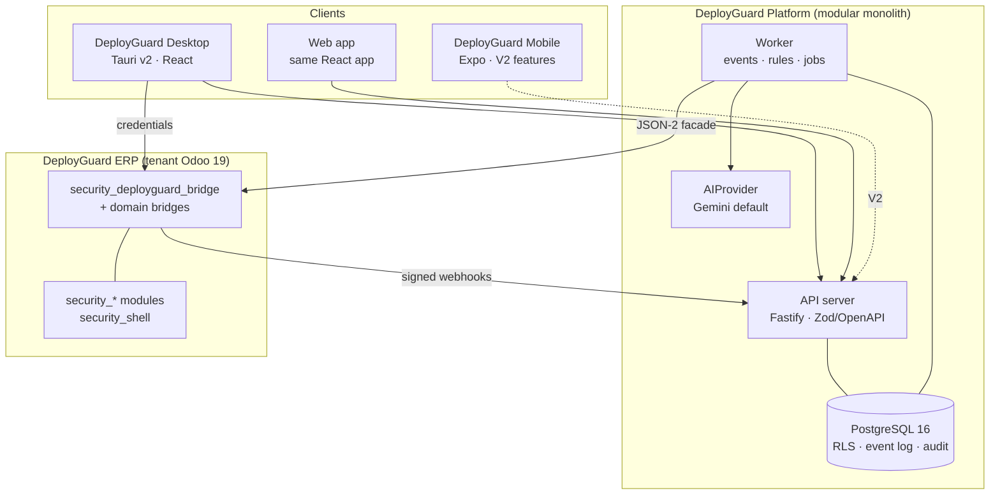

# DeployGuard OS — Planning Documentation

> Status: Planning baseline v1 · Date: 2026-09-15 · Owner: Platform architecture
>
> Source of truth for implementing **DeployGuard Platform** on top of **DeployGuard ERP** (Odoo 19). Planning only: no product code has been written. Start with this page, then [BUILD-ORDER](BUILD-ORDER.md).

---

## Executive summary

### 1. What DeployGuard OS is

The **human operations, training, adoption, accountability and intelligence layer above the ERP** for security companies. It is a product family:

- **DeployGuard ERP**: the existing Odoo 19 `security_*` suite, the system of record.
- **DeployGuard Platform**: the new backend, Windows desktop app and web app.
- **Bridge addons**: Odoo addons that connect the two.

See [01](01-product-vision.md) and [DG-ADR-019](adr/DG-ADR-019-product-naming.md).

### 2. What problem it solves

Security companies buy systems their people don't use. DogForce has a mature ERP with 37 installed modules, **210 employees and 4 internal users** ([00](00-current-state.md)). Small obstacles push staff back to WhatsApp and paper; managers can't see what *isn't* happening; the implementation partner becomes a human reminder service. DeployGuard OS makes the system notice, help, correct and escalate, so people don't have to chase each other.

### 3. Who uses it

| Audience | How |
|---|---|
| Site supervisors, operations officers, HR/admin, operations manager | Windows desktop app (MVP) |
| Owner | Web app and weekly digest |
| Tenant admins | Web app |
| Guards | Measured through ERP events in MVP; their own features arrive via DeployGuard Mobile in V2 |

Details in [03](03-personas-and-roles.md).

### 4. How it relates to Odoo

**Odoo stays authoritative** for employees, sites, rosters, attendance, incidents, leave, payroll and billing.

The Platform:

- reads those facts as projections;
- owns training, work, adoption, exceptions and intelligence;
- never duplicates ERP data.

**Single login from day one:** users sign in once with their Odoo credentials, and the Platform opens Odoo screens without a second login ([DG-ADR-007](adr/DG-ADR-007-authentication.md)). Integration uses signed webhooks plus reconciliation polling over Odoo 19's JSON-2 API ([12](12-odoo-integration.md)).

### 5. Core architecture



Key traits:

- **Modular monolith:** one TypeScript codebase with server and worker processes.
- **PostgreSQL as the only datastore:** multi-tenancy via forced RLS, a transactional event log with replay, append-only audit.
- **Thin clients:** no business rules on the desktop or web.
- **Desktop offline:** limited to field work, and it never fakes success.

Architecture docs: [12](12-odoo-integration.md)–[27](27-observability.md).

### 6. Recommended technology stack

| Layer | Choice | ADR |
|---|---|---|
| Desktop | **Tauri v2 + Rust (thin) + React/TypeScript** — hypothesis confirmed; Electron is the documented fallback | [001](adr/DG-ADR-001-desktop-framework.md) |
| Web | Vite + React SPA (TanStack Router/Query) shared with desktop; **not Next.js** | [016](adr/DG-ADR-016-web-framework.md) |
| Backend | Node.js 24 LTS, Fastify, Zod → OpenAPI, pg-boss | [002](adr/DG-ADR-002-backend-architecture.md) |
| Database / ORM | PostgreSQL 16 / **Drizzle** (not Prisma) | [003](adr/DG-ADR-003-database.md), [004](adr/DG-ADR-004-orm.md) |
| Monorepo | New `deployguard-platform` repo, pnpm + Turborepo, ≤ 8 packages | [005](adr/DG-ADR-005-monorepo.md) |
| Styling | Verbatim port of the DeployGuard design system (`--ds-*`, `--dgs-*`) with **`security_shell` parity**, lint-enforced | [017](adr/DG-ADR-017-design-system-and-shell-parity.md) |
| Integration | Odoo 19 JSON-2 facade + signed webhook outbox via bridge addons | [006](adr/DG-ADR-006-odoo-integration.md), [018](adr/DG-ADR-018-odoo-bridge-addons.md) |
| AI | `AIProvider` abstraction, **Gemini default** (via Vertex AI), capability registry with citation validation | [010](adr/DG-ADR-010-ai-architecture.md) |
| Hosting | Containers + managed PostgreSQL in Johannesburg, separate from the shared ERP host (pending budget) | [013](adr/DG-ADR-013-deployment.md) |
| Observability | OpenTelemetry + Sentry | [014](adr/DG-ADR-014-observability.md) |
| Testing | Vitest, Playwright (+ Tauri WebDriver), `cargo test`, Odoo 19 contract tests, AI evals | [25](25-testing-strategy.md) |

### 7. MVP

> A supervisor signs in **once**, sees exactly what to do today, does it (in the Platform or one click into Odoo), and gets help the moment something breaks. Their manager sees, in one list, what still needs a human.

The MVP includes:

- single login;
- bridge addons and projections;
- Windows desktop with shell parity;
- the training core with an 8-course "Using DeployGuard ERP" pack;
- recurring checklists with evidence and ERP auto-completion;
- expected-work adoption scoring with explanations and silent-abandonment assistance;
- deterministic exceptions with escalation and a manager inbox;
- feedback and support;
- email, desktop and in-app notifications;
- an owner digest.

**Not in MVP:** user-facing AI, guard features, workflows, WhatsApp, and any ERP capability. See [28](28-mvp-scope.md).

### 8. AI strategy

Rules decide facts; AI interprets them. AI runs through a controlled pipeline:

```
facts → allowlisted context → Gemini → validation → human approval → audited effect
```

Every insight cites evidence the reader can open and carries a computed confidence. AI never disciplines, changes HR, policy or financial records, or acts on Odoo. User-facing AI arrives in **V1, after the pilot**, once deterministic numbers are trusted and privacy terms are settled. See [11](11-ai-intelligence.md).

### 9. Productization strategy

Four layers:

1. platform primitives;
2. security-industry domain packs;
3. tenant configuration;
4. customer content.

DogForce is tenant #1 with **no special code paths**. Its configuration becomes the first starter pack. Commercial direction: Platform base, plus Training, Operations and Intelligence, plus a Managed Operations service. See [30](30-productization.md).

### 10. Recommended next implementation step

1. **This week:** close OQ-1 (hosting/budget), OQ-2 (naming) and OQ-11 (residency), and start **rollout Stage 0**:
   - rotate the credentials exposed in the repo;
   - verify HTTPS on the Odoo domain;
   - create Odoo users for the pilot staff;
   - restart ERP staging.
2. **Then P0 + P1:** foundations plus the bridge addon. P1 alone produces the **pre-rollout adoption baseline** from ERP data, the measurement every later claim of success depends on.

See [BUILD-ORDER](BUILD-ORDER.md) and [31](31-dogforce-rollout.md).

---

## Decisions already made by the product owner

| # | Decision |
|---|---|
| R-1 | Desktop MVP serves office staff and supervisors; guards via mobile/WhatsApp |
| R-2 | Bridge modules are Odoo-side addons |
| R-3 | All UI follows the DeployGuard design system; `security_shell` is the canonical UX |
| R-4 | Gemini is the default AI provider everywhere |
| R-5 | `security_suite` is outdated; per-client module baselines replace it |
| R-6 | Module code is never deleted for a client, only uninstalled per database |
| R-7 | Single login from MVP day one, using Odoo credentials |
| R-8 | Winston approves DogForce training content and SOP-derived templates |
| R-9 | No shared computers; no kiosk mode |

Open questions, contradictions and assumptions: [32](32-open-questions.md).

---

## Document map

| # | Document | Purpose |
|---|---|---|
| 00 | [Current state](00-current-state.md) | Verified facts, gaps, security findings, defects |
| 01 | [Product vision](01-product-vision.md) | Problem, loop, principles, success measures |
| 02 | [Product requirements](02-product-requirements.md) | Functional and non-functional requirements with IDs |
| 03 | [Personas & roles](03-personas-and-roles.md) | Role catalogue, hierarchy, personas, identity source |
| 04 | [Information architecture](04-information-architecture.md) | Shell structure, nav trees, screen inventory |
| 05 | [UX principles & design system](05-ux-principles.md) | Token port, hard rules, shell parity, states, wireframes |
| 06 | [Feature map](06-feature-map.md) | Capability × role × release |
| 07 | [Training platform](07-training-platform.md) | Courses, assessments, competency, adaptive, AI drafting |
| 08 | [Work management](08-work-management.md) | Primitives vs domain templates, recurrence, auto-complete |
| 09 | [Adoption engine](09-adoption-engine.md) | Expected work, score, explainability, silent abandonment |
| 10 | [Exception engine](10-exception-engine.md) | Rules, lifecycle, inbox, role views |
| 11 | [AI intelligence](11-ai-intelligence.md) | Pipeline, context, proactive capabilities, guardrails |
| 12 | [Odoo integration](12-odoo-integration.md) | Facade API, webhooks, polling, identity, SSO |
| 13 | [Event architecture](13-event-architecture.md) | Envelope, catalogue, examples, retention, replay |
| 14 | [Data model](14-data-model.md) | Contexts, aggregates, entities, data ownership |
| 15 | [Multi-tenancy](15-multi-tenancy.md) | RLS, configuration, secrets, lifecycle |
| 16 | [Security architecture](16-security-architecture.md) | Threat model, authz, desktop hardening, privacy |
| 17 | [Desktop architecture](17-desktop-architecture.md) | Rust/WebView split, IPC, storage, Odoo window |
| 18 | [Web architecture](18-web-architecture.md) | Shared SPA, web-only capabilities |
| 19 | [Backend architecture](19-backend-architecture.md) | Modules, anatomy, jobs, degradation |
| 20 | [Offline strategy](20-offline-strategy.md) | Minimum offline set, command outbox, conflicts |
| 21 | [Notification system](21-notification-system.md) | Categories, anti-spam, escalation ladders |
| 22 | [Analytics](22-analytics.md) | Metric catalogue, levels, rollups |
| 23 | [Audit system](23-audit-system.md) | Record shape, coverage, integrity |
| 24 | [API design](24-api-design.md) | Conventions, endpoint groups, errors |
| 25 | [Testing strategy](25-testing-strategy.md) | Layers, critical journeys, gates |
| 26 | [Deployment strategy](26-deployment-strategy.md) | Environments, pipelines, desktop distribution, DR |
| 27 | [Observability](27-observability.md) | Signals, SLIs, SLOs, alerting |
| 28 | [MVP scope](28-mvp-scope.md) | In/out, release definitions, scope guards |
| 29 | [Roadmap](29-roadmap.md) | Milestones, checkpoints, risks |
| 30 | [Productization](30-productization.md) | Layers, packs, onboarding, packaging |
| 31 | [DogForce rollout](31-dogforce-rollout.md) | Stage 0 prerequisites, stages 1–8, pilot, communication |
| 32 | [Open questions](32-open-questions.md) | Decisions, contradictions, open questions, assumptions |
| 33 | [ADR index](33-adr-index.md) | All DG-ADRs and their relation to ERP ADRs |
| 34 | [Feedback & support](34-feedback-and-support.md) | Taxonomy, context capture, support loop |
| 35 | [Competitive analysis](35-competitive-analysis.md) | Categories, gap, positioning |
| — | [BUILD-ORDER](BUILD-ORDER.md) | Phase-by-phase implementation sequence |
| — | [adr/](adr/) | DG-ADR-001 … DG-ADR-019 |

**Structure notes:**

- The brief's numbering is kept for traceability.
- **00** (current state), **34** (feedback & support) and **35** (competitive analysis) were added because their brief sections had no home.
- No documents were merged: each has distinct substance, and thin topics are kept short rather than padded.

---

## Brief traceability

| Brief § | Topic | Where addressed |
|---|---|---|
| 1 | Product vision | [01](01-product-vision.md) |
| 2 | Core principle | [01](01-product-vision.md) §4, §7 |
| 3 | DogForce context | [00](00-current-state.md), [01](01-product-vision.md) §1, [31](31-dogforce-rollout.md) |
| 4 | Desktop technology evaluation | [DG-ADR-001](adr/DG-ADR-001-desktop-framework.md) |
| 5 | Desktop vs backend separation | [17](17-desktop-architecture.md) §1, [DG-ADR-002](adr/DG-ADR-002-backend-architecture.md) |
| 6 | Identity & access | [03](03-personas-and-roles.md), [16](16-security-architecture.md) §3–4, [DG-ADR-007](adr/DG-ADR-007-authentication.md) |
| 7 | Employee workspace | [04](04-information-architecture.md), [05](05-ux-principles.md) §7.1, [02](02-product-requirements.md) §2 |
| 8 | Work management | [08](08-work-management.md) |
| 9 | Training / learning OS | [07](07-training-platform.md) §1–4, §6–7 |
| 10 | Adaptive training | [07](07-training-platform.md) §8 |
| 11 | Training content generation | [07](07-training-platform.md) §9, [11](11-ai-intelligence.md) §4.9 |
| 12 | Competency system | [07](07-training-platform.md) §5, [14](14-data-model.md) §6 |
| 13 | System adoption engine | [09](09-adoption-engine.md) §1–4, [13](13-event-architecture.md) |
| 14 | Silent abandonment | [09](09-adoption-engine.md) §5 |
| 15 | Employee feedback | [34](34-feedback-and-support.md) §1 |
| 16 | Support system | [34](34-feedback-and-support.md) §2–4, [11](11-ai-intelligence.md) §4.5 |
| 17 | Exception engine | [10](10-exception-engine.md) §1–5 |
| 18 | Manager inbox | [10](10-exception-engine.md) §6, [05](05-ux-principles.md) §7.2 |
| 19 | Owner / executive | [03](03-personas-and-roles.md) §3.5, [05](05-ux-principles.md) §7.4, [11](11-ai-intelligence.md) §4.3 |
| 20 | Operations manager | [03](03-personas-and-roles.md) §3.3, [04](04-information-architecture.md) §3.3 |
| 21 | Supervisor | [03](03-personas-and-roles.md) §3.1, [10](10-exception-engine.md) §7 |
| 22 | AI intelligence engine | [11](11-ai-intelligence.md) §1–2 |
| 23 | AI provider abstraction | [DG-ADR-010](adr/DG-ADR-010-ai-architecture.md) §1 |
| 24 | AI safety / control | [11](11-ai-intelligence.md) §6 |
| 25 | Odoo integration | [12](12-odoo-integration.md), [DG-ADR-006](adr/DG-ADR-006-odoo-integration.md), [DG-ADR-018](adr/DG-ADR-018-odoo-bridge-addons.md) |
| 26 | Data ownership | [14](14-data-model.md) §10 |
| 27 | Multi-tenancy | [15](15-multi-tenancy.md), [DG-ADR-008](adr/DG-ADR-008-multi-tenancy.md) |
| 28 | Security | [16](16-security-architecture.md) |
| 29 | Offline / network resilience | [20](20-offline-strategy.md), [DG-ADR-011](adr/DG-ADR-011-offline-architecture.md) |
| 30 | Notification engine | [21](21-notification-system.md), [DG-ADR-012](adr/DG-ADR-012-notifications.md) |
| 31 | Analytics | [22](22-analytics.md) |
| 32 | Auditability | [23](23-audit-system.md) |
| 33 | UX / design direction | [05](05-ux-principles.md), [DG-ADR-017](adr/DG-ADR-017-design-system-and-shell-parity.md) |
| 34 | Desktop + web + backend + Odoo split | [17](17-desktop-architecture.md), [18](18-web-architecture.md), [19](19-backend-architecture.md) |
| 35 | Technology evaluation | §6 above, [DG-ADR-001](adr/DG-ADR-001-desktop-framework.md)–[016](adr/DG-ADR-016-web-framework.md) |
| 36 | Repository strategy | [DG-ADR-005](adr/DG-ADR-005-monorepo.md) |
| 37 | Documentation deliverables | This README (document map) |
| 38 | ADRs | [33](33-adr-index.md), [adr/](adr/) |
| 39 | Database design | [14](14-data-model.md) |
| 40 | Event model | [13](13-event-architecture.md) |
| 41 | AI context model | [11](11-ai-intelligence.md) §3 |
| 42 | AI proactivity | [11](11-ai-intelligence.md) §4 |
| 43 | AI confidence | [11](11-ai-intelligence.md) §5 |
| 44 | DogForce MVP | [28](28-mvp-scope.md), [06](06-feature-map.md) |
| 45 | DogForce rollout | [31](31-dogforce-rollout.md) |
| 46 | Productization | [30](30-productization.md) §1–5, §7 |
| 47 | Commercial product thinking | [30](30-productization.md) §6 |
| 48 | Competitive analysis | [35](35-competitive-analysis.md) |
| 49 | Research requirement | [00](00-current-state.md) |
| 50 | Do not code yet | Planning only; no code produced |
| 51 | Final output | This README + [BUILD-ORDER](BUILD-ORDER.md) |
| 52 | Quality bar | [DG-ADR-002](adr/DG-ADR-002-backend-architecture.md), [DG-ADR-009](adr/DG-ADR-009-event-architecture.md), [28](28-mvp-scope.md) §5 |
| 53 | Final principle and loop | [01](01-product-vision.md) §2–3 |
